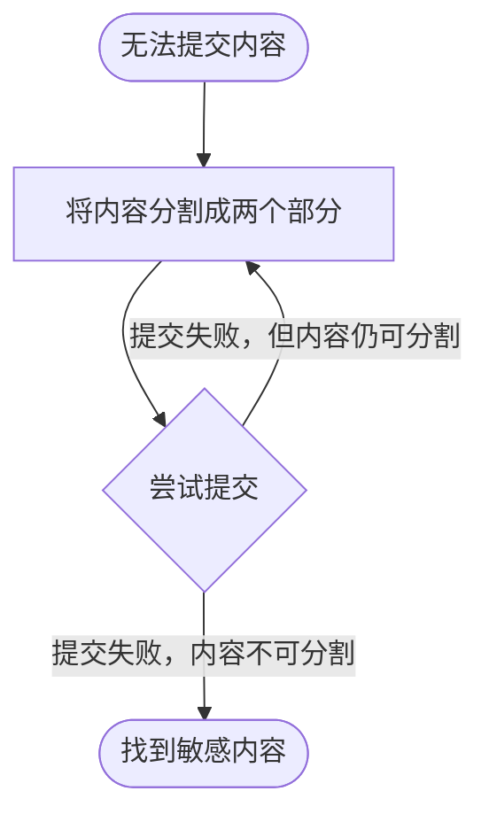

## 简介

由于审查的模糊性，通常很难得知一个平台的 [敏感词](/censorship/敏感词.md)、红线或者类似的东西，然后提交的内容就被不明不白的退回了，所以就将要发布的内容分成两个部分提交，尝试找到敏感词或者相似的东西。

理论上这个方法可以对任何内容使用，比如文字、音频、图片或者视频等。不过二分法测试主要还是常用在文字上，流程图如下：

## 实用性

二分法测试在早期是比较好用的方法，但现在很多服务都通过 [秘密屏蔽](/censorship/秘密屏蔽.md)、人工检测或者词语权重等方法，让这个方法逐渐失去了效用。目前 2022 年，这个方法在 [Bangumi 番组计划](/website/Bangumi_番组计划.md)、[豆瓣网](/website/豆瓣网.md) 还有效果。

如果分割后，词语就不再敏感了，就说明这是敏感词组合，二者在同一篇文字内，就会属于敏感词。
