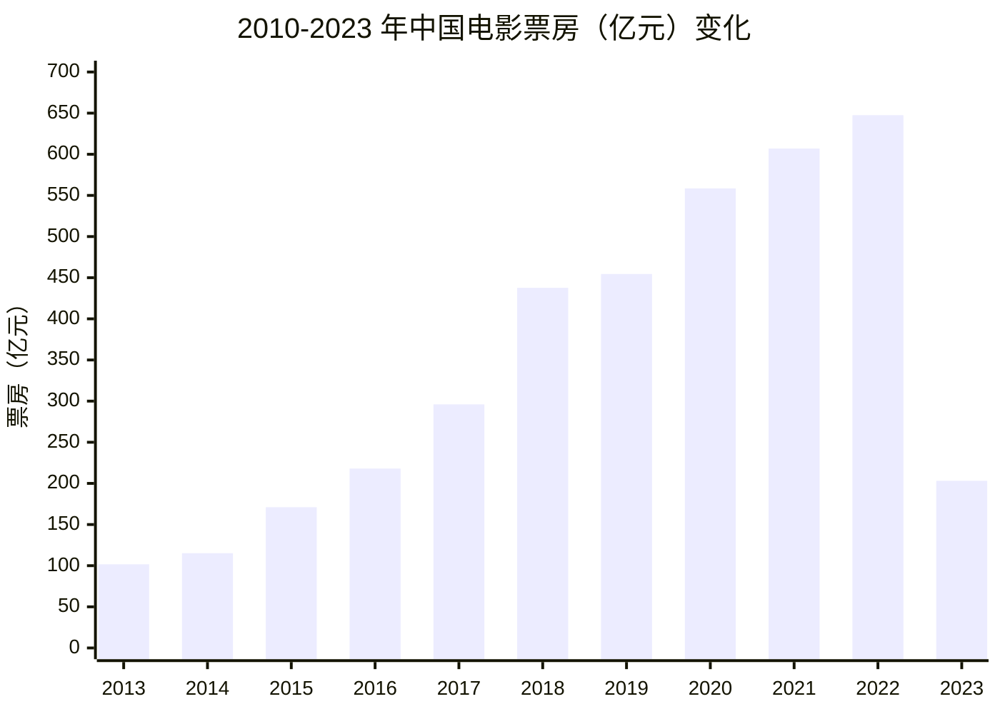

## 简介

《中华人民共和国电影产业促进法》是 2016 年中华人民共和国颁布的一部促进电影产业发展的法律，从电影制作、发行、
放映等各个环节作出相关规定。法案于 2016年11月7日 在第十二届全国人民代表大会常务委员会第二十四会议上表决通过，
并于 2017年3月1日 起正式施行。[^wiki]

[^wiki]: 《[中华人民共和国电影产业促进法](https://zh.wikipedia.org/wiki/中华人民共和国电影产业促进法)》, 维基百科. 2022-01-23. 参照: 2022-09-24. [Online].

## 电影分级制度

虽然电影分级制度没有正式写入此法中，但第 20 条提到「摄制电影的法人、
其他组织应当将取得的电影公映许可证标识置于电影的片头处；电影放映可能引起未成年人等观众身体或者心理不适的，
应当予以提示」。

2017年3月3日，《金刚狼3：殊死一战》成了新法实施后首部必须有明确发行公示的影片，
各大线上售票平台和线下售票窗口均被要求明确标示「小学生及学龄前儿童应在家长陪同下观看」的提示，
即便大陆版已经被减去了 15 分钟的内容。[^31019]

[^31019]: 飏, 《[〈电影产业促进法〉发威 要求〈金刚狼3〉加观影提示](https://web.archive.org/web/20170302193841/http://ent.qq.com/a/20170301/031019.htm?winzoom=1)》, 腾讯新闻, 2017-03-01. (参照 2022-09-24).

2017年7月13日，《大护法》上映，根据导演的说法，这是首部自主定级的暴力电影：[^63681]

[^63681]: 何小沁, 《[拒绝13岁以下观众！成人化动画〈大护法〉诞生记](https://web.archive.org/web/20220829070059/http://ent.sina.com.cn/original/2017-07-17/doc-ifyiakwa4263681.shtml)》, 新浪娱乐/特别企划, 2017-07-17. (参照 2022-09-24).

> [!quote]+ 导演原文[^63681]
>
> 很多人问我们 PG-13 是不是噱头，我说作为一个从业者，真的要有职业道德，这个片子千万不能给小朋友看，绝对不合适，
> 这份钱我们不赚。所以我们就参考了《金刚狼3》在国外的评级，给自己也定了一个 PG-13。新的电影法规定，
> 如果有不适合儿童观看的电影应该给出提示，所以我们也在各个影院、海报、购票平台上都写明了适合 13 岁以上观看。

2017 年，有提醒年龄的电影，还有《异形：<ruby>契约<rt>圣约</rt></ruby>》和《新木乃伊》，不过同样经过了大量删减。
比如《异形：契约》被删减了 6 分钟，几乎看不到异形了，所以被取了「已开：大勺」这样的外号。[^33805]
仅有《大护法》可能因为该法律，而得到了审查方面的豁免。

[^33805]: 乌鸦预告片, 《[〈异形契约〉删成〈巳开：大勺〉血腥画面几乎全无](https://web.archive.org/web/20240820155151/https://www.sohu.com/a/147067704_433805)》, 搜狐网, 2017-06-08. (参照 2024-08-20).

随后的 2018 年到 2020 年间，仅有三部电影有年龄限制，使该法律看起来没有发挥什么作用。之后是 SARS-CoV-2 流行期间，
电影业也停滞了，直到 2023 年末的《涉过愤怒的海》，在海报上标上「建议十八岁以下观众谨慎选择观看」的文字。

虽然是软性的限制，但这也算第一部，明确标出「十八禁」的大陆影院电影了吧。而实际内容，也确实对得起这段文字。
但奇怪的是之后《周处除三害》，没有在海报、购票处等地写上年龄提示，也许与《黑太阳731》有些类似，都有些政治宣传的成分在，
所以开了绿灯吧。

> [!quote]+ 安全教育的多重标准
>
> 一些学校的 [禁毒](https://web.archive.org/web/20190612010138/http://www.51miz.com/ppt/peixun/155529.html)、
> [交通安全](https://web.archive.org/web/20221201204506/https://auto.ifeng.com/qichezixun/20190602/1296446.shtml) 宣传，
> 使用了极端惨状，比如瘦骨嶙峋的吸毒者和交通事故血腥内容。这种「教育」类似
> [厌恶疗法](https://en.wikipedia.org/wiki/Aversion_therapy)，但是未经用户和监护人同意，就进行厌恶疗法，是非常不人道的。
>
> 因为厌恶疗法有可能引发其他心理问题，如焦虑、抑郁、疼痛、恐惧，严重时甚至引发创伤后应激障碍（PTSD）。类似的教育，还有
> [给学生看猎奇三级片《黑太阳 731》](http://archive.today/2024.02.01-100127/https://user.guancha.cn/main/content?id=653929)。
>
> 世界各地的香烟包装上，基本都印刷者醒目的警示文字或图像，比如死亡率、增加病症风险等文字，以及病变的肺、穿孔的咽喉、
> 烂掉的牙齿等令人不适的照片。之所以做么做，
> 是因为这些地区签署了 Framework Convention on Tobacco Control（烟草控制框架公约）。
>
> 但是此公约的简体中文版翻译《世界卫生组织烟草控制框架公约》，
> [被恶意翻译](https://theinitium.com/zh-Hans/article/20240121-mainland-china-tobacco-video-explainer)。
> 许多语句中的「需」（Shall）被翻译成了「应」和「宜」，结果简中烟盒的警示用语，是世界上最弱的。
>
> 利益相关：小学时，学校开展交通安全宣传活动，实际上就是给看血腥事故现场画面的宣传海报。结果之后的多年，
> gledos 都没法一个人过马路，也许算是某种 PTSD 吧。

之后引进的「十八禁」电影还有《疯狂的麦克斯•狂暴女神》《死侍与金刚狼》《异形：夺命舰》，
令人震惊的是除了《死侍与金刚狼》，其他两部都被认为没有删减画面（翻译可能有调整），而《死侍与金刚狼》仅仅删减了 1 分钟，
对剧情没有明显影响的部分。

### 电影清单

| 上映时间   | 名称                      | 提示文字                                                                                                                   |
| ---------- | ------------------------- | -------------------------------------------------------------------------------------------------------------------------- |
| 2017-03-03 | 金刚狼3： 殊死一战     | 小学生及学龄前儿童应在家长陪同下观看 （售票区域以及海报）[^31019] 【猫眼平台无提醒】[^47875]                         |
| 2017-06-09 | 新木乃伊                  | 小学生及学龄前儿童应在家长陪同下观看（售票区域[^54162] 猫眼平台[^49895]）                                                  |
| 2017-06-16 | 异形：契约                | 学龄前儿童及小学生应在家长陪同下观看（售票区域）[^09867] 【猫眼平台无提醒】[^78888]                                     |
| 2017-07-13 | 大护法                    | 建议学龄前儿童和小学生在家长的陪同下观看（海报）[^34363] 建议 13 岁以上观众观看（猫眼平台）[^44682]                     |
| 2018-04-13 | 湮灭                      | 小学生及学龄前儿童应在家长陪同下观看（售票区域[^51923] 猫眼平台[^38426]）                                                  |
| 2019-12-31 | 妙先生                    | 建议十三岁以上观众观看（海报）[^72746] 【猫眼平台无提醒】[^01444]                                                       |
| 2020-10-01 | 姜子牙                    | 建议八岁以上观众观看（预告片结尾）[^33705][^380D0] 建议 8 岁以上观众观看（猫眼平台）[^11269]                            |
| 2023-11-25 | 涉过愤怒的海              | 建议十八岁以下观众谨慎选择观看（海报[^MQH00] 猫眼平台[^98381]）                                                            |
| 2023-12-08 | 爆裂点                    | 温馨提示：十八岁以下观众请在家长陪同下观看（部分海报）[^19164][^WMX00][^75205] 【猫眼平台无提醒】[^74410]               |
| 2024-03-01 | 周处除三害                | 未成年人谨慎观影（发布在新浪微博的搞怪海报）[^ZMB00] 【猫眼平台无提醒】[^88960] 【售票、检票处应该也无提醒】[^64SKC] |
| 2024-04-19 | 童话•世界                 | 建议 15 周岁以上观众观看（海报）[^7DNB8] 【猫眼平台无提醒】[^69175]                                                     |
| 2024-06-07 | 疯狂的麦克斯 •狂暴女神 | 未成年人需在家长陪同下观看（美团简介[^59038] 猫眼平台[^23570]）                                                            |
| 2024-07-03 | 默杀                      | 建议未成年观众谨慎选择观看（海报[^72116] 猫眼平台[^28124]）                                                                |
| 2024-07-26 | 死侍与金刚狼              | 18 岁以下观众 谨慎选择观看（海报[^78PGH] 猫眼平台[^00478]）                                                                |
| 2024-08-16 | 异形：夺命舰              | 未成年观众谨慎选择观看（海报） 建议未成年观众，谨慎选择观看。（猫眼平台）[^64004]                                       |

＊ 「提示文字」部分，若未提及海报相关内容，那么就是海报里没有写上年龄提示文字。

[^47875]: [金刚狼3：殊死一战](https://m.maoyan.com/asgard/movie/247875), 猫眼电影.

[^54162]: 珠海中影国际影城, 《[〈新木乃伊〉6月9日来了！颤抖吧，漫威宇宙~小学生及学龄前儿童应在家长陪同下观看](https://web.archive.org/web/20240821081603/https://www.sohu.com/a/145518980_754162)》, 搜狐网, 2017-06-02. (参照 2024-08-21).

[^49895]: [新木乃伊](https://m.maoyan.com/asgard/movie/249895), 猫眼电影.

[^09867]: 南城盛世国际影城, 《[【温馨提示】儿童及小学生应在家长陪同下观看！是什么又要看又吓人...](https://web.archive.org/web/20240820160127/https://www.sohu.com/a/148935239_99909867)》, 搜狐网, 2017-06-14. (参照 2024-08-21).

[^78888]: [异形：契约](https://m.maoyan.com/asgard/movie/78888), 猫眼电影.

[^34363]: ONE有影力, 《[正因为它的奇怪与与众不同，我才更想推荐它](https://web.archive.org/web/20240821125100/https://www.sohu.com/a/157403275_534363)》, 搜狐网, 2017-07-15. (参照 2024-08-21).

[^44682]: [大护法](https://m.maoyan.com/asgard/movie/344682), 猫眼电影.

<!-- [^00495]: 坦洲中影嘉纳国际影城, 《[《异形：契约》小学生及学龄前儿童应在家长陪同下观影](https://www.sohu.com/a/www.sohu.com/a/151236965_800495)》, 搜狐网, 2017-06-23. (参照 2024-08-21). -->

[^51923]: 丰景, 《[孩子看〈湮灭〉要家长陪同，这会是中国电影分级制的开端吗？](https://web.archive.org/web/20180614033551/http://www.qdaily.com/articles/51923.html)》, 好奇心日报, 2018-04-10. (参照 2022-09-24).

[^38426]: [湮灭](https://m.maoyan.com/asgard/movie/338426), 猫眼电影.

[^72746]: 钟菡, 《[动画电影〈妙先生〉31日上映，片方提醒：13岁以上解锁](https://web.archive.org/web/20240821082523/https://www.jfdaily.com/news/detail?id=272746)》, 上观新闻, 2020-07-24. (参照 2024-08-21).

[^01444]: [妙先生](https://m.maoyan.com/asgard/movie/1301444), 猫眼电影.

[^33705]: 3DMGame, 《[《姜子牙〉曝终极版预告 官方建议8岁以上观众观看](https://web.archive.org/web/20200118163245/https://hot.cnbeta.com/articles/comic/933705.htm)》, cnBeta.COM, 2020-01-17. (参照 2024-08-21).

[^380D0]: 网易娱乐, 《[《姜子牙〉曝终极预告 国产团队打造东方新英雄](https://web.archive.org/web/20240821083405/https://www.163.com/ent/article/F38DQ9S3000380D0.html)》, 网易, 2020-01-19. (参照 2024-08-21).

[^11269]: [姜子牙](https://m.maoyan.com/asgard/movie/1211269), 猫眼电影.

[^MQH00]: 正观新闻, 《[文艺观丨《涉过愤怒的海〉贴出“十八之禁”，中国电影分级之路还要走多久](https://news.qq.com/rain/a/20231201A07MQH00)》, 腾讯新闻, 2023-12-01. (参照 2024-08-21).

[^98381]: [涉过愤怒的海](https://m.maoyan.com/asgard/movie/1298381), 猫眼电影.

[^19164]: 热荐电影, 《[〈爆裂点〉尺度大开的背后，是永不可逾越的做人底线](https://web.archive.org/web/20240821085013/https://www.sohu.com/a/742809440_119164)》, 搜狐网, 2023-12-09. (参照 2024-08-21).

[^WMX00]: 博纳电影, 《[年度最“疯”电影〈爆裂点〉发布“临界点”版海报 “避无可避！退无可退！忍无可忍！失无可失！”](https://web.archive.org/web/20240728225715/https://new.qq.com/rain/a/20231115A06WMX00)》, 腾讯新闻, 2023-11-15. (参照 2024-08-21).

[^75205]: 单梦蛙, 《[张家辉 陈伟霆主演！动作片〈爆裂点〉发布“开干”海报](https://web.archive.org/web/20240821085345/https://www.gamersky.com/news/202311/1675205.shtml)》, 游民星空 GamerSky.com, 2023-11-23. (参照 2024-08-21).

[^74410]: [爆裂点](https://m.maoyan.com/asgard/movie/1474410), 猫眼电影.

[^ZMB00]: 影视独舌, 《[〈周处除三害〉公映前换盘，触发“尺度焦虑症”？](https://web.archive.org/web/20240821091226/https://new.qq.com/rain/a/20240303A03ZMB00)》, 腾讯新闻, 2024-03-03. (参照 2024-08-21).

[^88960]: [周处除三害](https://m.maoyan.com/asgard/movie/1488960), 猫眼电影.

[^64SKC]: 影视原说a, 《[该来的还是来了，〈周处除三害〉被家长投诉，孩子被吓哭了](https://web.archive.org/web/20240309180752/https://www.163.com/dy/article/ISS1EQFG05564SKC.html)》, 网易新闻, 2024-03-09. (参照 2024-08-21).

[^7DNB8]: 淘票票, 《[电影〈童话·世界〉今日上映！三大看点解锁台湾现实题材电影](https://web.archive.org/web/20240821091629/https://www.163.com/dy/article/J04T3RHL0517DNB8.html)》, 网易新闻／网易号, 2024-04-19. (参照 2024-08-21).

[^69175]: [童话·世界](https://m.maoyan.com/asgard/movie/1469175), 猫眼电影.

[^59038]: 只爱村花, 《[疯狂的麦克斯：狂暴女神的讨论 - 还真没删减](https://web.archive.org/web/20240820153931/https://m.douban.com/movie/discussion/637659038)》, 豆瓣(手机版), 2024-06-11. (参照 2024-08-21).

[^23570]: [疯狂的麦克斯：狂暴女神](https://m.maoyan.com/asgard/movie/1323570), 猫眼电影.

[^72116]: 郝茕, 《[〈默杀〉：初心和匠气](https://web.archive.org/web/20240809034739/https://www.thepaper.cn/newsDetail_forward_27972116)》, 澎湃新闻-The Paper, 电影《默杀》提档至7月3日-. (参照 2024-08-21).

[^28124]: [默杀](https://m.maoyan.com/asgard/movie/1528124), 猫眼电影.

[^78PGH]: 网易, 《[〈死侍与金刚狼〉内地定档！18岁以下谨慎观看](https://web.archive.org/web/20240821092402/https://www.163.com/dy/article/J4THR6F405178PGH.html)》, 网易新闻／网易号, 2024-06-17. (参照 2024-08-21).

[^00478]: [死侍与金刚狼](https://m.maoyan.com/asgard/movie/1200478), 猫眼电影.

[^64004]: [异形：夺命舰](https://m.maoyan.com/asgard/movie/1464004), 猫眼电影.

| 名称                  | 引进删减情况               |
| --------------------- | -------------------------- |
| 金刚狼3：殊死一战     | 14 分钟[^95984]            |
| 新木乃伊              | 4 分钟[^46107]             |
| 异形：契约            | 6 分钟[^TX200]             |
| 大护法                | 【非引进】                 |
| 湮灭                  | 1 分钟[^96704]             |
| 妙先生                | 【非引进】                 |
| 姜子牙                | 【非引进】                 |
| 涉过愤怒的海          | 【非引进】                 |
| 爆裂点                | 未知                       |
| 周处除三害            | 切镜头降低暴力程度[^2P900] |
| 童话•世界             | 未知                       |
| 疯狂的麦克斯•狂暴女神 | 被认为没有删减[^61408]     |
| 默杀                  | 【非引进】                 |
| 死侍与金刚狼          | 1 分钟／10 处[^92871]      |
| 异形：夺命舰          | 无画面删减[^gledos]        |

[^95984]: 姜大噪, 《[《金刚狼3》被删减的14分钟到底是什么？](https://web.archive.org/web/20240618192252/https://movie.douban.com/review/8395984/)》, 豆瓣, 2017-03-04. (参照 2024-08-21).

[^46107]: Dr.tomato, 《[〈新木乃伊〉 关于4分钟删减的内容？](https://web.archive.org/web/20240821135509/https://movie.douban.com/subject/20451290/questions/746107/)》, 豆瓣电影, 2017-06-02. (参照 2024-08-21).

[^TX200]: 一起拍电影／无念, 《[内地引进R级片生态考](https://web.archive.org/web/20240821081022/https://new.qq.com/rain/a/20210510A04TX200)》, 腾讯新闻／腾讯平台创作者, 2021-05-10. (参照 2024-08-21).

[^96704]: 山竹, 《[删减的部分还是影响了剧情](https://web.archive.org/web/20240821135329/https://movie.douban.com/review/9296704/)》, 豆瓣, 2018-04-14. (参照 2024-08-21).

[^2P900]: 电影大菠萝, 《[没删减，也能上映？你不知道的〈周处除三害〉](https://web.archive.org/web/20240407124420/https://new.qq.com/rain/a/20240307A092P900)》, 腾讯新闻, 2024-03-07. (参照 2024-08-21).

[^61408]: fk, 《[大陆版肯定是和谐了很多的吧？](https://web.archive.org/web/20240820161256/https://movie.douban.com/subject/34996127/discussion/637661408/)》, 豆瓣, 2024-06-09. (参照 2024-08-21).

[^92871]: BAGGIO, 《[关于大陆公映版所有删减片段统计](https://web.archive.org/web/20240820170221/https://movie.douban.com/review/16092871/)》, 豆瓣, 2024-07-31. (参照 2024-08-20).

[^gledos]: gledos 亲自对比大陆影院版与国际盗摄版本，没有发现画面删减，但翻译可能有调整。

### 异形：夺命舰

《<ruby>异形<rt>Alien</rt></ruby><ruby>：<rt>:</rt></ruby><ruby>夺命舰<rt>Romulus</rt></ruby>》（異形：羅穆路斯），
是 2024年8月17日 在大陆上映的电影，与大部分地区的上映时间相同。

但正如上文所说，《异形：夺命舰》并没有删减。比起《异形：契约》删减到几乎看不到异形，《异形：夺命舰》的变化确实很大。
也许因为《契约》的删减情况，所以有观众以为《夺命舰》也会如此删减，就带上了儿童前去观影。然而造成了儿童受到惊吓的情况：
「影城收到投诉，有观众称自家 8 岁小孩观影途中受到惊吓，需要影城出具检查费用。」[^51058][^db39e]

[^51058]: 翔安区融媒体中心, 《[热搜第一！8岁孩子观影吓到“不适”，家长要求影院退票并赔偿](https://web.archive.org/web/20240831072435/https://www.thepaper.cn/newsDetail_forward_28451058)》, 澎湃新闻-The Paper, 2024-08-18. (参照 2024-08-31).

[^db39e]: 翔安区融媒体中心, 《[热搜第一！8岁孩子观影吓到“不适”，家长要求影院退票并赔偿](https://web.archive.org/web/20240831072411/https://mp.weixin.qq.com/s?__biz=MzU1NDQxMTE2Mw==&mid=2248212530&idx=2&sn=126110185bd1141347889d8f14ddb39e)》, 微信公众号／业翔民安, 2024-08-18. (参照 2024-08-31).

但是成都商报旗下的红星新闻、[^8NI00] 新京报，[^47478]
以及「中国共产党厦门市翔安区委员会宣传部」的社交帐号「翔安发布」，[^51058][^db39e]
都将责任归咎于家长，理由是电影海报、官方新浪微博和影院工作人员，都已经提醒了「未成年观众谨慎选择观看」。

[^8NI00]: 成都商报红星新闻, 《[〈异形：夺命舰〉吓坏8岁小孩？业内人士提醒：未成年观众谨慎选择观看](https://web.archive.org/web/20240831073038/https://new.qq.com/rain/a/20240817A078NI00)》, 腾讯新闻, 2024-08-17. (参照 2024-08-31).

[^47478]: 熊丙奇, 《[“〈异形〉太吓人了！”家长不能无视观影提醒](https://web.archive.org/web/20240820155814/http://epaper.bjnews.com.cn/html/2024-08/20/content_847478.htm)》, 新京报电子报, 2024-08-20. (参照 2024-08-31).

甚至，新华网转发了羊城晚报的《〈异形〉遭家长投诉 凸显「电影分级制」的缺位》。文章最后提到希望发布统一标准的电影分级制，
切实保护观众权益。[^a4c9d]

[^a4c9d]: 江德斌, 《[《异形》遭家长投诉 凸显“电影分级制”的缺位](https://web.archive.org/web/20240831083550/http://www.news.cn/comments/20240820/f65c18db05204746a08e5f3e757a4c9d/c.html)》, 新华网／羊城晚报, 2024-08-20. (参照 2024-08-31).

<!-- 变暗 -->

### 电影票房

这与多年前，将电影删减到类似全年龄向的情况，完全不同。有人猜测这几年票房太少，于是有人决定松掉「卡脖子」的手，
让电影环境「缺乏监管」。数据上可以支持这个猜测，2024 年截止 7 月的票房，共计 291.79 亿，[^e2024]
而 2023 年前 7 个月的票房为 346.69 亿。[^e2023]

[^e2023]: Boxofficecn, 《[2023 中国票房](https://web.archive.org/web/20231208231227/http://www.boxofficecn.com/boxoffice2023)》, 中国电影票房排行榜, 2023-. (参照 2024-08-21).

[^e2024]: Boxofficecn, 《[2024 中国票房](https://web.archive.org/web/20240413092322/http://www.boxofficecn.com/boxoffice2024)》, 中国电影票房排行榜, 2024-. (参照 2024-08-21).

下面是「小牛行研」统计的《2010-2023 年中国电影票房（亿元）及观影人次（亿次）变化》。[^90707]

[^90707]: 《[2010-2023年中国电影票房（亿元）及观影人次（亿次)变化](https://web.archive.org/web/20240821141912/https://www.hangyan.co/charts/3366193446367790707)》, 小牛行研／行业研究数据, 2024-05-12. (参照 2024-08-31).

## 历史

2003年11月，冯小刚在第 12 届金鸡百花电影节导演恳谈会上，强烈建议设立中国电影分级制。随后北京青年报记者，
采访了不具名的有关人士：

> [!quote]+ 《有关人士表示：中国电影分级也不会有「三级片」》摘录[^9254s]
>
> 问：我国几十年来为何不搞电影分级制？
>
> 答：中国内地电影实行分级制，不是一件一个人的小事，而是一件关系到国家、人民的大事，不是今天说明天就能办的，它涉及许许多多的法规，比如严格的版权保护和院线管理，即使内地实行了分级制，许多影片仍然是不适合拍摄的，这些在《电影管理条例》中就有明确规定。比如即使中国实行电影分级制，也要考虑到社会接受程度。在国外，分级后的电影在黄金时间是受限制的，不仅时间上受限制，在场次上也受限制。香港明文规定，政府官员不得进入影院观看三级片。
>
> 问：冯小刚导演提出根据《未成年人保护法》，内地电影应设立两个等级，如 16 岁以下青少年不宜和 16岁以上观众可以观看的电影，但是在实施的过程中，怎么能保证做到呢？
>
> 答：这是一个综合执法的问题。如果实行电影分级制，那么审查权、院线制到剧本都应进行全方位改革。首先我们现在还没有分级制影院，在香港的分级制影院，警察可直接进电影院检查观众的身份证。在正版的音像商店，政府的告示会贴在门口：如果发现分级影片卖给 16 岁以下的青少年，那么这个店就会被查封，店主会倾家荡产。我们目前还做不到，抓盗版主要靠文化市场稽查队，它没有执法权。
>
> 问：如果实行分级制，将以什么为划分标准呢？
>
> 答：提倡建立分级制的出发点，主要是为了保护青少年的身心健康，有关方面目前参考《预防未成年人犯罪法》和《未成年人保护法》，将 16 岁作为电影分级制度的基本切口。但有一点可以肯定，就是不会有所谓的「三级片」。

[^9254s]: 姜薇（新华网转载北京青年报）, 《[有关人士表示：中国电影分级也不会有“三级片”](https://web.archive.org/web/20050426183644/http://news.sina.com.cn/c/2003-11-21/07341159254s.shtml)》, 新浪网, 2003-11-21. (参照 2024-08-31).

2010年8月，国家广电总局副局长赵实表示：做了许多电影的分级调研，但是其他国家依然未能有效控制青少年观众等进入市场、
影院、网络、网吧看电影的情况。所以目前还不适宜推进电影分级制。[^53898]

[^53898]: 杨华云, 《[广电总局称中国目前不适宜电影分级制](https://web.archive.org/web/20240831090955/http://v.china.com.cn/news/2010-08/20/content_20753898.htm)》, 中国网／新京报, 2010-08-20. (参照 2024-08-31).
