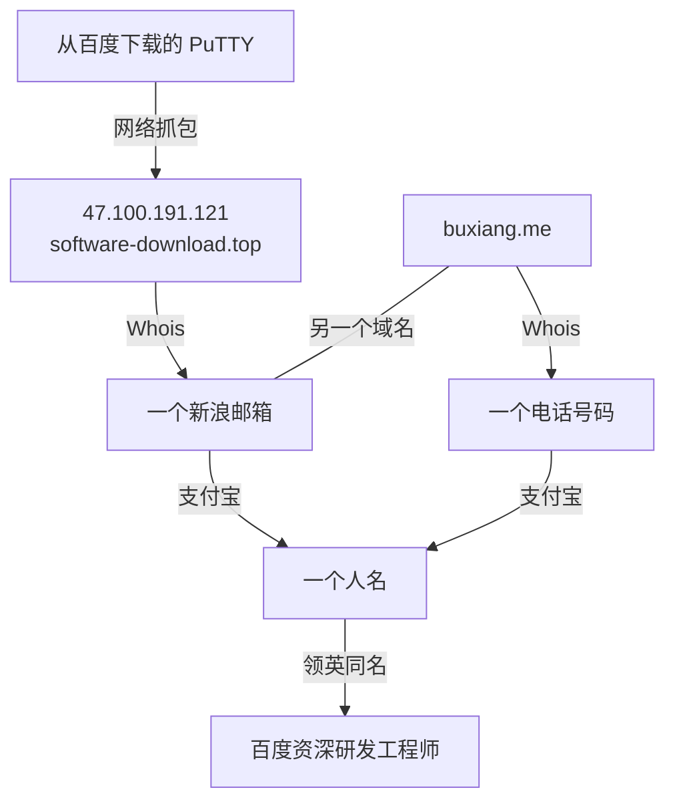

## 简介

> [!summary inline end]+ 元数据
>
> 
>
> ```yaml
> 名称: 百度软件中心
> 网站: rj.baidu.com
> ```

「百度软件中心」是百度的软件商店平台，主要是 Windows 软件，也有 Mac 系统，前身的百度卫士附带的「百度软件」，最早出现的时间可能是 2013 年。[^4451] 自称全部软件均已经过百度杀毒的安全认证。[^22042725]

[^4451]: 《[百度软件](https://web.archive.org/web/20131018014451/http://rj.baidu.com/)》, 2013-10-18. (参照 2022-08-22).

[^22042725]: 《[百度软件中心](https://web.archive.org/web/20220822072745/https://baike.baidu.com/item/百度软件中心/22042725)》, 百度百科, 2022-08-22. (参照 2022-08-22).

## 恶意软件

2018年4月27日，有人发现了「百度软件中心」分发的 PuTTY 会包含捆绑软件，即使点击的不是「高速下载器」，而是普通下载。[^450427]

[^450427]: xiaoyu9527, 《[百度的 putty 会自动安装爱奇艺和毒霸](https://web.archive.org/web/20180615172810/https://www.v2ex.com/t/450427)》, V2EX, 2018-04-27. (参照 2022-08-22).

2018年5月8日，RTFM 确认「百度软件中心」分发的 PuTTY 被实际上是个下载器，运行它后会先下载金山毒霸和爱奇艺等软件列表，之后才开始下载真正的 PuTTY。[^499]

[^499]: RTFM, 《[被污染的百度下载，被捆绑的Putty，为什么受伤的总是程序员？！](https://web.archive.org/web/20220822071933/https://x.threatbook.com/v5/article?threatInfoID=499)》, 微步在线X情报社区, 2018-05-08. (参照 2022-08-22).

等到 PuTTY 开始运行后，就会在后台静默下载软件列表中的捆绑软件。然后 RTFM 根据连接的服务器，找到了手机号，然后通过支付宝找到了实名，并且此名称与领英上的一位百度员工相同。所以 RTFM 猜测此员工利用职务之便实施了此次恶意推广活动。



2018年5月9日，百度将 PuTTY 的页面下架了，[^171211] 2018年5月10日「百度软件中心」也被无法访问了，[^453645] 百度关闭了此项目。

[^171211]: Sphinx, 《[百度软件中心版putty被曝恶意捆绑软件](https://web.archive.org/web/20220523090622/https://www.freebuf.com/news/171211.html)》, FreeBuf网络安全行业门户, 2018-05-09. (参照 2022-08-22).

[^453645]: 580a388da131, 《[百度软件中心关了吗？](https://web.archive.org/web/20220822080130/https://www.v2ex.com/t/453645)》, V2EX, 2018-05-10. (参照 2022-08-22).
