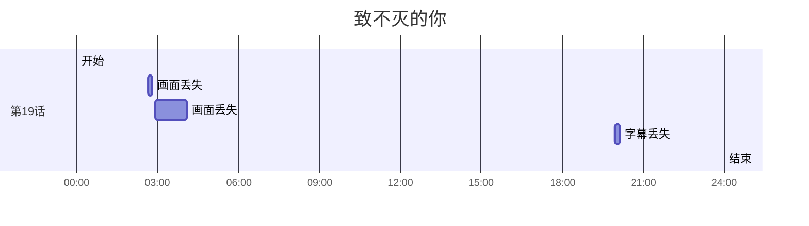

## 简介

ggame 算是收录各种审查相关内容的文档，但主要维护者只有 gledos，所以大多数内容都没法深入。
不过好在有其他对审查记录感兴趣的人，编写了擅长主题的记录。

> [!note]- ggame 简史
>
> 使用 Telegram，对隐私有一些要求的 gledos，也不是一开始就有这些想法，而是从生活中遇到的一点一滴，逐渐得到的生存方式。
>
> 新华网在 2010年8月，曾发布文章《[谷歌服务「被屏蔽」的「乌龙事件」说明了什么？][29504]》，
> 内容大意是：Google 的技术故障导致了无法访问，然后 gledos 信了 🤣
>
> 之后为了游玩 [未引进的游戏](https://microblogging.gledos.science/posts/1063)，开始接触 Steam，
> 为了更容易的查阅游戏相关的内容，也就开始使用 hosts + HTTPS 来访问 Google。但此时的 gledos 依然对问题视而不见，
> 毕竟只要能玩到喜欢的游戏，那就继续过平静的生活。
>
> 但在 2017年5月，Steam 开始出现各种网络问题。之前视而不见的问题，终于还是来到了喜爱游戏的 gledos 面前。
> 原本视而不见的问题，开始作妖，才让 gledos 思考各种问题。其中有意识到中文记录的稀缺，
> 于是编写了《[steam在大陆网络问题的捕风捉影](https://gledos.science/wegame-steam.html)》
> （当时的写法太生疏，比较难以阅读），用于记录历史。
>
> 最后在 2020年9月，ggame 网站被搭建，写作「游戏和谐 Wiki」，实则记录各种审查相关的百科全书，上线了。
> （更完整的 ggame 简史，可以在 [GitHub Gist](https://gist.github.com/gledos/3b8c525b9cadb8d7df095fe94e998d92) 阅读）

[29504]: https://web.archive.org/web/20221028123449/http://www.scio.gov.cn/ztk/hlwxx/03/4/Document/729504/729504.htm

## 番剧删减表

番剧删减表是个 Hexo 网站，由「番剧删减汇总酱」编写。从 2021年4月 的每个季度开始，哔哩哔哩放送的日本动画审查情况。
都会精确记录，比如「01：07 画面丢失 6s」给出了时间轴以及修改情况。

原始链接为：<https://hzj.wiki/>

> [!note]- 2024年4月新番删减表
>
> [原始链接](https://hzj.wiki/202404/)
>
> <!-- [](https://lain.bgm.tv/r/400//pic/cover/l/ef/8f/283643_2bcm7.jpg) -->
>
> > [!summary]- 吹响吧！上低音号 第三季
> >
> > [第01话](https://b23.tv/ep819314 "播放")
> >
> > ```text
> > 12：08 字幕丢失 1s
> > ```
> >
> > ---
> >
> > [第03话](https://b23.tv/ep819316 "播放")
> >
> > ```text
> > 05：20 画面和谐
> > 05：21 画面丢失 3s
> > ```
> >
> > ---
> >
> > [第12话](https://b23.tv/ep825575 "播放")
> >
> > ```text
> > 23：22 画面和谐
> > ```text
> >
> > ---
> >
> > [第13话](https://b23.tv/ep825576 "播放")
> >
> > ```text
> > 12：55 画面和谐
> > ```text
> >
> > <!-- [](https://lain.bgm.tv/r/400//pic/cover/l/19/1a/405785_u9it9.jpg) -->
>
> > [!summary]- 摇曳露营△ 第三季
> >
> > [第07话](https://b23.tv/ep823828 "播放")
> >
> > ```text
> > 18：00 画面和谐
> > ```
> >
> > ---
> >
> > [第10话](https://b23.tv/ep825944 "播放")
> >
> > ```text
> > 21：48 画面和谐
> > ```
> >
> > <!-- [](https://lain.bgm.tv/r/400//pic/cover/l/f2/8f/425909_M7W7T.jpg) -->
>
> > [!summary]- 夜晚的水母不会游泳
> >
> > [第01话](https://b23.tv/ep819318 "播放")
> >
> > ```text
> > 01：41 字幕丢失 2s
> > 01：55 画面和谐
> > 16：38 画面和谐
> > ```
> >
> > ---
> >
> > [第02话](https://b23.tv/ep819319 "播放")
> >
> > ```text
> > 03：12 画面和谐
> > 16：33 字幕丢失 2s
> > ```
> >
> > ---
> >
> > [第03话](https://b23.tv/ep819320 "播放")
> >
> > ```text
> > 11：32 画面和谐 字幕丢失 2s
> > ```
> >
> > ---
> >
> > [第04话](https://b23.tv/ep819850 "播放")
> >
> > ```text
> > 06：33 字幕丢失 16s
> > 10：15 画面丢失 35s
> > ```
> >
> > ---
> >
> > [第05话](https://b23.tv/ep819320 "播放")
> >
> > ```text
> > 21：44 画面丢失 7s
> > ```
> >
> > ---
> >
> > [第06话](https://b23.tv/ep819852 "播放")
> >
> > ```text
> > 10：31 画面丢失 25s
> > 12：06 字幕丢失 3s
> > 16：23 画面和谐
> > ```
> >
> > ---
> >
> > [第07话](https://b23.tv/ep823447 "播放")
> >
> > ```text
> > 06：41 画面丢失 13s
> > 06：48 字幕丢失 2s
> > 07：00 画面丢失 3s
> > 12：21 画面丢失 1m1s
> > 13：41 画面丢失 32s
> > 14：17 画面和谐
> > ```
> >
> > ---
> >
> > [第08话](https://b23.tv/ep823448 "播放")
> >
> > ```text
> > 05：56 画面和谐
> > 06：50 画面丢失 7s
> > ```
> >
> > ---
> >
> > [第09话](https://b23.tv/ep823449 "播放")
> >
> > ```text
> > 05：52 画面和谐
> > 23：23 画面和谐
> > ```
> >
> > ---
> >
> > [第10话](https://b23.tv/ep825188 "播放")
> >
> > ```text
> > 06：10 画面和谐
> > ```
> >
> > ---
> >
> > [第11话](https://b23.tv/ep825189 "播放")
> >
> > ```text
> > 02：36 画面丢失 6s
> > 09：56 画面和谐
> > ```
> >
> > ---
> >
> > [第12话](https://b23.tv/ep825190 "播放")
> >
> > ```text
> > 02：31 画面丢失
> > 16：30 画面丢失 6s
> > 20: 07 画面和谐
> > ```
> >
> > <!-- [](https://lain.bgm.tv/r/400//pic/cover/l/9c/d2/394623_qErlO.jpg) -->
>
> > [!summary]- 怪兽8号
> >
> > [第01话](https://b23.tv/ep819571 "播放")
> >
> > ```text
> > 02：01 画面丢失 2s
> > 06：36 画面和谐
> > 07：08 画面和谐
> > ```
> >
> > ---
> >
> > [第02话](https://b23.tv/ep819572 "播放")
> >
> > ```text
> > 10：31 画面丢失 1s
> > 13：02 画面丢失 1s
> > ```
> >
> > ---
> >
> > [第03话](https://b23.tv/ep819573 "播放")
> >
> > ```text
> > 17：26 画面丢失 1s
> > 19：19 画面丢失 6s
> > ```
> >
> > ---
> >
> > [第04话](https://b23.tv/ep821140 "播放")
> >
> > ```text
> > 15：52 画面丢失 2s
> > 15：56 画面丢失 5s
> > 16：22 画面和谐
> > ```
> >
> > ---
> >
> > [第12话](https://b23.tv/ep829106 "播放")
> >
> > ```text
> > 10：31 画面丢失 4s
> > ```
> >
> > <!-- [](https://lain.bgm.tv/r/400//pic/cover/l/ca/63/449562_5itkq.jpg) -->
>
> > [!summary]- 老夫老妻重返青春
> >
> > [第01话](https://b23.tv/ep819775 "播放")
> >
> > ```text
> > 08：38 画面丢失 19s
> > ```
> >
> > ---
> >
> > [第02话](https://b23.tv/ep819776 "播放")
> >
> > ```text
> > 04：32 画面丢失 2s
> > 04：35 画面和谐
> > 07：17 画面和谐
> > 09：52 画面和谐
> > ```
> >
> > ---
> >
> > [第03话](https://b23.tv/ep819777 "播放")
> >
> > ```text
> > 11：50 画面和谐
> > 12：28 画面和谐 字幕和谐
> > ```
> >
> > ---
> >
> > [第07话](https://b23.tv/ep823819 "播放")
> >
> > ```text
> > 07：48 画面和谐
> > 07：53 字幕和谐
> > 07：56 字幕和谐
> > 11：38 画面和谐
> > 11：58 画面丢失 10s
> > 14：24 画面丢失 8s
> > 15：15 字幕丢失 4s
> > 15：21 画面和谐
> > 19：25 画面丢失 19s
> > ```
> >
> > ---
> >
> > [第10话](https://b23.tv/ep825956 "播放")
> >
> > ```text
> > 12：12 画面丟失 48s
> > 13：42 画面和谐
> > ```
> >
> > ---
> >
> > <!-- [](https://lain.bgm.tv/r/400//pic/cover/l/7b/a0/411974_MKw1Y.jpg) -->
>
> > [!summary]- 声优广播的台词幕后
> >
> > [第02话](https://b23.tv/ep818579 "播放")
> >
> > ```text
> > 08：02 字幕丢失 6s
> > ```
> >
> > ---
> >
> > [第03话](https://b23.tv/ep818580 "播放")
> >
> > ```text
> > 04：21 画面丢失 3m12s
> > ```
> >
> > ---
> >
> > [第05话](https://b23.tv/ep820132 "播放")
> >
> > ```text
> > 15：41 画面丢失 30s
> > ```
> >
> > ---
> >
> > [第06话](https://b23.tv/ep820133 "播放")
> >
> > ```text
> > 17：01 画面丢失 56s
> > ```
> >
> > ---
> >
> > [第12话](https://b23.tv/ep825960 "播放")
> >
> > ```text
> > 15：46 字幕丢失 3s
> > 16：26 字幕丢失 3s
> > ```
> >
> > <!-- [](https://lain.bgm.tv/r/400//pic/cover/l/2a/6d/365952_Sg7SY.jpg) -->
>
> > [!summary]- 神渴望着游戏。
> >
> > [第03话](https://b23.tv/ep818698 "播放")
> >
> > ```text
> > 16：46 画面丢失 24s
> > ```
> >
> > ---
> >
> > [第09话](https://b23.tv/ep823282 "播放")
> >
> > ```text
> > 07：09 画面丢失 1m57s
> > ```
> >
> > ---
> >
> > [第11话](https://b23.tv/ep825565 "播放")
> >
> > ```text
> > 05：58 画面丢失 3s
> > ```
> >
> > ---
> >
> > [第12话](https://b23.tv/ep825566 "播放")
> >
> > ```text
> > 20：10 画面丢失 12s
> > ```
> >
> > <!-- [](https://lain.bgm.tv/r/400//pic/cover/l/36/44/410939_nKQHe.jpg) -->
>
> > [!summary]- 无名记忆
> >
> > [第01话](https://b23.tv/ep819339 "播放")
> >
> > ```text
> > 16：23 字幕丢失 10s
> > ```
> >
> > ---
> >
> > [第02话](https://b23.tv/ep819340 "播放")
> >
> > ```text
> > 17：02 画面丢失 2s
> > ```
> >
> > ---
> >
> > [第11话](https://b23.tv/ep825965 "播放")
> >
> > ```text
> > 11：28 画面丢失 2s
> > ```
> >
> > ---
> >
> > [第12话](https://b23.tv/ep825966 "播放")
> >
> > ```text
> > 18：44 画面丢失 6s
> > ```

> [!note]- 2024年1月新番删减表
>
> [原始链接](https://hzj.wiki/202401/)
>
> <!-- [](https://lain.bgm.tv/r/400//pic/cover/l/c5/88/395378_hH7Cg.jpg) -->
>
> > [!summary]- 迷宫饭
> >
> > [第08话](https://b23.tv/ep813277 "播放")
> >
> > ```text
> > 06：59 画面丢失 6s
> > ```
> >
> > ---
> >
> > [第11话](https://b23.tv/ep815460 "播放")
> >
> > ```text
> > 18：15 画面丢和谐
> > 8：20 画面丢失 2s
> > ```
> >
> > ---
> >
> > [第12话](https://b23.tv/ep815461 "播放")
> >
> > ```text
> > 09：23 画面和谐 画面丢失 2s
> > ```
> >
> > ---
> >
> > [第14话](https://b23.tv/ep818710 "播放")
> >
> > ```text
> > 10：04 画面丢失 3s
> > ```
> >
> > ---
> >
> > [第15话](https://b23.tv/ep818711 "播放")
> >
> > ```text
> > 03：36 画面和谐
> > 03：46 画面和谐
> > 03：50 画面和谐
> > 04：43 画面和谐
> > ```
> >
> > ---
> >
> > [第17话](https://b23.tv/ep819630 "播放")
> >
> > ```text
> > 06：48 画面丢失 3s
> > ```
> >
> > ---
> >
> > [第20话](https://b23.tv/ep819848 "播放")
> >
> > ```text
> > 08：17 画面和谐
> > 08：29 画面丢失 3s
> > ```
> >
> > ---
> >
> > [第21话](https://b23.tv/ep819849 "播放")
> >
> > ```text
> > 15：30 画面丢失 2s
> > ```
> >
> > ---
> >
> > [第23话](https://b23.tv/ep823841 "播放")
> >
> > ```text
> > 03：18 画面和谐
> > ```
> >
> > ---
> >
> > [第24话](https://b23.tv/ep823842 "播放")
> >
> > ```text
> > 18：48 画面和谐
> > ```
> >
> > <!-- [](https://lain.bgm.tv/r/400//pic/cover/l/f5/2e/390353_07vz7.jpg) -->
>
> > [!summary]- 我独自升级
> >
> > [第01话](https://b23.tv/ep814603 "播放")
> >
> > ```text
> > 19：20 画面丢失 8s
> > ```
> >
> > ---
> >
> > [第02话](https://b23.tv/ep814614 "播放")
> >
> > ```text
> > 08：10 画面丢失 2s
> > 08：44 画面丢失 6s
> > 09：04 画面丢失 3s
> > 10：42 画面丢失 6s
> > 11：37 画面丢失 4s
> > 20：59 画面丢失 2s
> > 21：08 字幕丢失 3s
> > ```
> >
> > ---
> >
> > [第03话](https://b23.tv/ep814615 "播放")
> >
> > ```text
> > 00：00 画面和谐
> > 00：07 画面丢失 3s
> > ```
> >
> > ---
> >
> > [第06话](https://b23.tv/ep816608 "播放")
> >
> > ```text
> > 17：54 画面丢失 1s
> > 18：50 画面丢失 1s
> > 20：08 画面丢失 4s
> > ```
> >
> > <!-- [](https://lain.bgm.tv/r/400//pic/cover/l/e2/51/406628_2u4B4.jpg) -->
>
> > [!summary]- 我被逐出队伍后过上慢生活 第二季
> >
> > [第01话](https://b23.tv/ep814628 "播放")
> >
> > ```text
> > 12：00 画面丢失 3s
> > 13：39 画面和谐
> > ```
> >
> > ---
> >
> > [第02话](https://b23.tv/ep814629 "播放")
> >
> > ```text
> > 05：12 画面和谐
> > 05：34 画面丢失 2s
> > 07：27 画面丢失 15s
> > 07：32 画面丢失 27s
> > ```
> >
> > ---
> >
> > [第03话](https://b23.tv/ep814630 "播放")
> >
> > ```text
> > 19：11 画面和谐
> > 20：30 画面丢失 10s
> > ```
> >
> > ---
> >
> > [第04话](https://b23.tv/ep817743 "播放")
> >
> > ```text
> > 23：20 画面丢失 13s
> > ```
> >
> > ---
> >
> > [第05话](https://b23.tv/ep817744 "播放")
> >
> > ```text
> > 13：17 画面丢失 7s
> > 13：18 画面和谐
> > 19：52 画面和谐 画面丢失 6s
> > 19：56 画面丢失 4s
> > ```
> >
> > <!-- [](https://lain.bgm.tv/r/400//pic/cover/l/f8/39/443493_ZfhAh.jpg) -->
>
> > [!summary]- 物理魔法使-马修-神觉者候选人选拔考试篇
> >
> > [第20话](https://b23.tv/ep818382 "播放")
> >
> > ```text
> > 10：14 字幕丢失 9s
> > ```
> >
> > <!-- [](https://lain.bgm.tv/r/400//pic/cover/l/ba/26/411450_5j4c7.jpg) -->
>
> > [!summary]- 青之驱魔师 岛根启明结社篇(收录中)
> >
> > [第02话](https://b23.tv/ep816104 "播放")
> >
> > ```text
> > 01：53 字幕丢失 2s
> > 12：44 字幕丢失 6s
> > ```
> >
> > ---
> >
> > [第03话](https://b23.tv/ep816105 "播放")
> >
> > ```text
> > 00：06 字幕丢失 3s
> > ```
> >
> > ---
> >
> > [第08话](https://b23.tv/ep818846 "播放")
> >
> > ```text
> > 08：22 画面丢失 16s
> > ```
> >
> > <!-- [](https://lain.bgm.tv/r/400//pic/cover/l/aa/72/425595_E7WOC.jpg) -->
>
> > [!summary]- 金属口红/METALLIC ROUGE
> >
> > [第07话](https://b23.tv/ep813280 "播放")
> >
> > ```text
> > 17：37 画面丢失 2s
> > ```

> [!note]- 2023年10月新番删减表
>
> [原始链接](https://hzj.wiki/202310/)
>
> <!-- [](https://lain.bgm.tv/r/400//pic/cover/l/13/c5/400602_ZI8Y9.jpg) -->
>
> > [!summary]- 葬送的芙莉莲
> >
> > [第06话](https://b23.tv/ep780982 "播放")
> >
> > ```text
> > 12：16 画面丢失 6s
> > ```
> >
> > ---
> >
> > [第09话](https://b23.tv/ep787484 "播放")
> >
> > ```text
> > 18：27 画面丢失 2s
> > ```
> >
> > <!-- [](https://lain.bgm.tv/r/400//pic/cover/l/cd/d6/406736_2raEH.jpg) -->
>
> > [!summary]- 冒险者女儿到大都市当了S级冒险者
> >
> > [第01话](https://b23.tv/ep780871 "播放")
> >
> > ```text
> > 21：36 画面丢失 9s
> > ```
> >
> > ---
> >
> > [第05话](https://b23.tv/ep780875 "播放")
> >
> > ```text
> > 17：58 画面丢失 44s
> > ```
> >
> > ---
> >
> > [第07话](https://b23.tv/ep780877 "播放")
> >
> > ```text
> > 21：50 画面丢失 7s
> > ```
> >
> > <!-- [](https://lain.bgm.tv/r/400//pic/cover/l/6d/7a/398922_ORyRa.jpg) -->
>
> > [!summary]- 捡到退婚大小姐的我，教她幸福的事
> >
> > [第02话](https://b23.tv/ep780895 "播放")
> >
> > ```text
> > 13：53 画面丢失 15s
> > ```
> >
> > ---
> >
> > [第03话](https://b23.tv/ep780896 "播放")
> >
> > ```text
> > 09：53 画面丢失 3s
> > 14：30 画面丢失 5s
> > 19：49 画面丢失 5s
> > ```
> >
> > ---
> >
> > [第04话](https://b23.tv/ep780897 "播放")
> >
> > ```text
> > 13：57 字幕丢失 3s
> > 14：43 画面丢失 31s
> > ```
> >
> > ---
> >
> > [第05话](https://b23.tv/ep780898 "播放")
> >
> > ```text
> > 13：29 画面丢失 4s
> > ```
> >
> > ---
> >
> > [第07话](https://b23.tv/ep780900 "播放")
> >
> > ```text
> > 11：37 画面和谐 画面丢失 1s
> > 11：53 画面丢失 2s
> > ```
> >
> > ---
> >
> > [第08话](https://b23.tv/ep780901 "播放")
> >
> > ```text
> > 06：23 画面丢失 15s
> > ```
> >
> > <!-- [](https://lain.bgm.tv/r/400//pic/cover/l/4b/52/362255_MjGGW.jpg) -->
>
> > [!summary]- 米奇与达利
> >
> > [第02话](https://b23.tv/ep780839 "播放")
> >
> > ```text
> > 02：27 画面丢失 23s
> > 06：22 画面丢失 7s
> > ```
> >
> > ---
> >
> > [第03话](https://b23.tv/ep780840 "播放")
> >
> > ```text
> > 12：00 画面和谐
> > 12：18 画面和谐
> > 14：51 画面丢失 10s
> > ```
> >
> > ---
> >
> > [第04话](https://b23.tv/ep780841 "播放")
> >
> > ```text
> > 03：06 画面丢失 5s
> > 14：20 画面和谐
> > 15：48 画面丢失 45s
> > 19：46 字幕和谐
> > 19：05 字幕和谐 画面丢失 3s
> > ```
> >
> > ---
> >
> > [第05话](https://b23.tv/ep780842 "播放")
> >
> > ```text
> > 06：34 画面丢失 11s
> > ```
> >
> > ---
> >
> > [第06话](https://b23.tv/ep780843 "播放")
> >
> > ```text
> > 17：47 画面丢失 3s
> > ```
> >
> > ---
> >
> > [第07话](https://b23.tv/ep780844 "播放")
> >
> > ```text
> > 02：52 字幕丢失 2s
> > 09：50 画面丢失 4s
> > 11：31 画面丢失 4s
> > 14：26 画面丢失 1m48s
> > 16：15 画面丢失 3s
> > ```
> >
> > ---
> >
> > [第08话](https://b23.tv/ep786018 "播放")
> >
> > ```text
> > 07：07 画面丢失 3s
> > ```
> >
> > ---
> >
> > [第09话](https://b23.tv/ep786019 "播放")
> >
> > ```text
> > 05：38 画面丢失 23s
> > 19：43 画面丢失 5s
> > ```
> >
> > ---
> >
> > [第10话](https://b23.tv/ep786020 "播放")
> >
> > ```text
> > 12：52 画面丢失 10s
> > 14：30 画面丢失 3s
> > ```
> >
> > ---
> >
> > [第11话](https://b23.tv/ep805558 "播放")
> >
> > ```text
> > 17：18 字幕丢失 1s 17：23 字幕丢失 3s
> > ```
> >
> > ---
> >
> > [第12话](https://b23.tv/ep805559 "播放")
> >
> > ```text
> > 00：00 画面丢失 51s
> > ```
> >
> > ---
> >
> > [第13话](https://b23.tv/ep805560 "播放")
> >
> > ```text
> > 01：15 字幕丢失 2s
> > 19：53 字幕丢失 2s
> > ```

> [!note]- 2023年7月新番删减表
>
> [原始链接](https://hzj.wiki/202307/)
>
> <!-- [](https://lain.bgm.tv/r/400//pic/cover/l/4c/b3/362006_A52M3.jpg) -->
>
> > [!summary]- 主宰七魔剑
> >
> > [第01话](https://b23.tv/ep756463 "播放")
> >
> > ```text
> > 21：04 画面和谐
> > ```
> >
> > ---
> >
> > [第03话](https://b23.tv/ep756465 "播放")
> >
> > ```text
> > 01：07 画面丢失 6s
> > ```
> >
> > ---
> >
> > [第06话](https://b23.tv/ep762802 "播放")
> >
> > ```text
> > 18：10 画面丢失 12s
> > ```
> >
> > ---
> >
> > [第09话](https://b23.tv/ep765819 "播放")
> >
> > ```text
> > 03：53 字幕丢失 3s
> > ```
> >
> > ---
> >
> > [第12话](https://b23.tv/ep767043 "播放")
> >
> > ```text
> > 15：22 字幕丢失 2s
> > ```
> >
> > ---
> >
> > [第13话](https://b23.tv/ep770557 "播放")
> >
> > ```text
> > 12：31 画面丢失 3s
> > ```
> >
> > ---
> >
> > [第14话](https://b23.tv/ep770558 "播放")
> >
> > ```text
> > 16：37 字幕丢失 3s
> > ```
> >
> > <!-- [](https://lain.bgm.tv/r/400//pic/cover/l/85/da/426531_rW41Z.jpg) -->
>
> > [!summary]- 物之古物奇谭 Part 2
> >
> > [第15话](https://b23.tv/ep755268 "播放")
> >
> > ```text
> > 20：08 画面丢失 3s
> > 20：10 画面丢失 1s
> > ```
> >
> > ---
> >
> > [第16话](https://b23.tv/ep755269 "播放")
> >
> > ```text
> > 00：16 画面丢失 3s
> > 00：18 画面丢失 1s
> > ```
> >
> > <!-- [](https://lain.bgm.tv/r/400//pic/cover/l/4e/fd/403225_1HS63.jpg) -->
>
> > [!summary]- 打工吧！魔王大人 第二季 Part 2
> >
> > [第13话](https://b23.tv/ep756567 "播放")
> >
> > ```text
> > 18：40 画面和谐
> > ```
> >
> > <!-- [](https://lain.bgm.tv/r/400//pic/cover/l/4e/d4/363102_WYdFP.jpg) -->
>
> > [!summary]- 浪客剑心 \-明治剑客浪漫谭\- (新作)
> >
> > [第02话](https://b23.tv/ep763749 "播放")
> >
> > ```text
> > 15：12 字幕丢失 3
> > 15：14 字幕丢失 4s
> > ```
> >
> > ---
> >
> > [第07话](https://b23.tv/ep774188 "播放")
> >
> > ```text
> > 02：26 画面丢失 2s
> > 05：11 画面丢失 5s
> > ```
> >
> > ---
> >
> > [第08话](https://b23.tv/ep774189 "播放")
> >
> > ```text
> > 10：44 画面丢失 3s
> > ```
> >
> > <!-- [](https://lain.bgm.tv/r/400//pic/cover/l/ac/22/405198_PoyZL.jpg) -->
>
> > [!summary]- 公司的小小前辈(更新中)
> >
> > [第01话](https://b23.tv/ep766292 "播放")
> >
> > ```text
> > 00：00 画面和谐
> > 00：24 画面和谐 画面丢失 7s
> > 01：14 画面和谐
> > 04：48 画面和谐 画面丢失 3s
> > 04：58 字幕丢失 3s
> > 05：04 画面丢失 16s
> > 05：45 画面丢失 13s
> > 07：58 画面丢失 3s
> > 15：50 画面和谐
> > 15：58 画面丢失 6s
> > ```
> >
> > ---
> >
> > [第02话](https://b23.tv/ep766293 "播放")
> >
> > ```text
> > 04：18 画面丢失 17s
> > 04：20 画面丢失 1s
> > 06：30 画面丢失 6s
> > 09：35 画面和谐
> > 09：45 画面丢失 5s
> > 14：42 画面和谐
> > ```
> >
> > ---
> >
> > [第03话](https://b23.tv/ep766294 "播放")
> >
> > ```text
> > 08：36 画面丢失 4s
> > 20：18 画面和谐
> > 20：34 画面和谐
> > > 20：52 画面丢失 13s
> > ```
> >
> > ---
> >
> > [第04话](https://b23.tv/ep769433 "播放")
> >
> > ```text
> > 00：27 画面丢失 2s
> > 04：02 画面和谐
> > 12：18 画面丢失 10s
> > 13：23 字幕丢失 4s
> > 13：50 画面和谐
> > 13：58 字幕和谐
> > 16：37 画面丢失 6s
> > 17：22 画面丢失 2s
> > 17：24 画面和谐
> > 17：36 画面丢失 2s
> > 17：39 字幕丢失 2s
> > 17：43 画面和谐
> > 18：25 画面丢失 5s
> > 18：48 字幕丢失 2s
> > ```
> >
> > ---
> >
> > [第05话](https://b23.tv/ep769434 "播放")
> >
> > ```text
> > 04：32 画面丢失 7s
> > 09：45 画面丢失 48s
> > 12：54 画面和谐
> > 19：45 画面和谐
> > 19：56 画面和谐
> > ```
> >
> > ---
> >
> > [第06话](https://b23.tv/ep769435 "播放")
> >
> > ```text
> > 00：00 画面丢失 4s
> > 00：02 画面和谐
> > 01：02 画面和谐
> > 01：12 画面和谐
> > 04：23 字幕丢失 4s
> > 04：40 字幕丢失 3s
> > 04：51 画面丢失 6s
> > 04：58 画面丢失 3s
> > 05：04 画面和谐
> > 05：15 画面和谐
> > 07：03 画面和谐
> > 08：37 画面和谐
> > 09：40 画面和谐
> > 10：18 画面和谐
> > 10：26 画面丢失 26s
> > 11：19 画面和谐 画面丢失 13s
> > 11：30 画面和谐
> > 12：08 字幕丢失 3s
> > 13：14 画面和谐
> > 15：10 画面和谐
> > ```
> >
> > ---
> >
> > [第07话](https://b23.tv/ep770428 "播放")
> >
> > ```text
> > 05：27 画面和谐
> > 06：01 画面和谐 画面丢失 3s
> > 14：03 画面丢失 10s
> > ```
> >
> > ---
> >
> > [第08话](https://b23.tv/ep770429 "播放")
> >
> > ```text
> > 01：11 画面丢失 5s
> > 04：02 画面和谐
> > 04：46 画面和谐
> > 05：48 画面丢失 画面和谐 5s
> > 06：18 画面丢失 画面和谐 1s
> > 08：36 画面和谐
> > 08：53 画面和谐
> > 10：06 画面和谐
> > 10：14 画面和谐
> > 10：18 画面和谐
> > 10：24 画面和谐
> > 10：51 画面丢失 1m3s
> > 10：55 画面丢失 画面和谐 3s
> > 01：01 画面丢失5s
> > 11：08 画面和谐
> > 12：01 画面和谐
> > 12：32 画面丢失 2s
> > 12：51 画面丢失 10s
> > 14：30 画面和谐
> > 14：40 画面丢失 画面和谐 2s
> > 14：53 画面丢失 50s
> > 15：42 画面和谐
> > 15：50 画面和谐
> > 16：25 画面和谐
> > 16：43 画面和谐 画面丢失 2s
> > 18：19 画面和谐
> > 18：27 画面丢失 4s
> > 18：40 画面和谐
> > ```
> >
> > ---
> >
> > [第09话](https://b23.tv/ep770430 "播放")
> >
> > ```text
> > 04：36 画面丢失 5s
> > 05：50 画面和谐
> > 05：51 画面丢失 5s
> > 05：57 画面丢失 2s
> > 06：55 画面丢失 14s
> > 07：00 画面和谐 画面丢失 20s
> > 08：12 画面和谐 画面丢失 1s
> > 08：23 画面和谐 画面丢失 4s
> > 08：45 字幕和谐
> > 21：50 画面和谐
> > ```
> >
> > ---
> >
> > [第10话](https://b23.tv/ep773956 "播放")
> >
> > ```text
> > 04：17 画面和谐 06：40 画面丢失 7s
> > 06：42 画面丢失 1s
> > 06：43 画面丢失 3s
> > 07：34 画面丢失 9s
> > 16：58 画面丢失 4s
> > ```
> >
> > ---
> >
> > [第11话](https://b23.tv/ep773957 "播放")
> >
> > ```text
> > 18：06 画面和谐
> > ```
> >
> > <!-- [](https://lain.bgm.tv/r/400//pic/cover/l/10/b4/426815_WHFN2.jpg) -->
>
> > [!summary]- 文豪野犬 第五季
> >
> > [第01话](https://b23.tv/ep768190 "播放")
> >
> > ```text
> > 20：53 画面丢失 6s
> > ```
> >
> > ---
> >
> > [第03话](https://b23.tv/ep768192 "播放")
> >
> > ```text
> > 22：16 画面丢失 2s
> > ```
> >
> > ---
> >
> > [第04话](https://b23.tv/ep768193 "播放")
> >
> > ```text
> > 19：06 画面丢失 1s
> > ```
> >
> > ---
> >
> > [第09话](https://b23.tv/ep771963 "播放")
> >
> > ```text
> > 07：02 画面丢失 4s
> > ```
> >
> > <!-- [](https://lain.bgm.tv/r/400//pic/cover/l/bb/bf/425236_3CtyP.jpg) -->
>
> > [!summary]- 莱莎的炼金工房～常暗女王与秘密藏身处
> >
> > [第05话](https://b23.tv/ep771185 "播放")
> >
> > ```text
> > 04：16 画面丢失 画面和谐 2s
> > 18：19 画面丢失 2s
> > ```

> [!note]- 2023年4月新番删减表
>
> [原始链接](https://hzj.wiki/202304/)
>
> <!-- [](https://lain.bgm.tv/r/400/pic/cover/l/0e/c3/365437_O84Is.jpg) -->
>
> > [!summary]- 放学后失眠的你
> >
> > [第01话](https://b23.tv/ep743983 "播放")
> >
> > ```text
> > 12：03 画面和谐
> > ```
> >
> > ---
> >
> > [第03话](https://b23.tv/ep743985 "播放")
> >
> > ```text
> > 07：12 画面丢失 6s
> > ```
> >
> > ---
> >
> > [第05话](https://b23.tv/ep748227 "播放")
> >
> > ```text
> > 19：15 画面丢失 4s
> > 19：17 画面丢失 12s
> > 19：30 画面丢失 26s
> > 19：37 画面和谐
> > 19：56 画面丢失 6s
> > ```
> >
> > ---
> >
> > [第06话](https://b23.tv/ep748228 "播放")
> >
> > ```text
> > 21：39 画面和谐
> > 22：05 画面和谐
> > ```
> >
> > ---
> >
> > [第07话](https://b23.tv/ep748229 "播放")
> >
> > ```text
> > 14：22 画面丢失 画面和谐
> > 14：30 画面和谐
> > 14：41 画面和谐
> > 15：38 画面和谐
> > ```
> >
> > ---
> >
> > [第08话](https://b23.tv/ep751442 "播放")
> >
> > ```text
> > 19：33 画面和谐
> > 22：01 画面丢失 10s
> > ```
> >
> > ---
> >
> > [第09话](https://b23.tv/ep751443 "播放")
> >
> > ```text
> > 00：25 画面丢失 画面和谐 8s
> > 13：28 画面和谐
> > 13：32 画面丢失 6s
> > 13：35 画面和谐
> > 14：01 画面丢失 3s
> > 14：41 画面和谐
> > ```
> >
> > ---
> >
> > [第10话](https://b23.tv/ep751444 "播放")
> >
> > ```text
> > 01：34 画面丢失 14s
> > ```
> >
> > ---
> >
> > [第11话](https://b23.tv/ep752417 "播放")
> >
> > ```text
> > 14：20 画面丢失 3s
> > 19：26 画面丢失 23s
> > 21：02 字幕和谐
> > ```
> >
> > <!-- [](https://lain.bgm.tv/r/400/pic/cover/l/ed/6c/325673_ylAdh.jpg) -->
>
> > [!summary]- 祭品公主与兽之王
> >
> > [第01话](https://b23.tv/ep741757 "播放")
> >
> > ```text
> > 17：11 画面丢失 3s
> > ```
> >
> > ---
> >
> > [第08话](https://b23.tv/ep751453 "播放")
> >
> > ```text
> > 11：14 画面丢失 2s
> > ```
> >
> > ---
> >
> > [第12话](https://b23.tv/ep753198 "播放")
> >
> > ```text
> > 21：34 画面丢失 5s
> > ```
> >
> > ---
> >
> > [第18话](https://b23.tv/ep764463 "播放")
> >
> > ```text
> > 01：18 画面丢失 2s
> > ```
> >
> > <!-- [](https://lain.bgm.tv/r/400/pic/cover/l/17/03/424372_h6JZ1.jpg) -->
>
> > [!summary]- 石纪元 第三季
> >
> > [第05话](https://b23.tv/ep743988 "播放")
> >
> > ```text
> > 10：03 画面和谐
> > ```
> >
> > ---
> >
> > [第07话](https://b23.tv/ep748239 "播放")
> >
> > ```text
> > 03：33 字幕丢失 2s
> > ```
> >
> > ---
> >
> > [第08话](https://b23.tv/ep748240 "播放")
> >
> > ```text
> > 10：00 画面和谐
> > ```
> >
> > ---
> >
> > [第09话](https://b23.tv/ep748241 "播放")
> >
> > ```text
> > 10：49 画面和谐
> > 11：46 画面和谐
> > 19：47 画面和谐
> > ```
> >
> > <!-- [](https://lain.bgm.tv/r/400/pic/cover/l/63/4e/357961_RtPiz.jpg) -->
>
> > [!summary]- 跃动青春
> >
> > [第08话](https://b23.tv/ep750407 "播放")
> >
> > ```text
> > 11：40 画面丢失 7s
> > ```
> >
> > <!-- [](https://lain.bgm.tv/r/400/pic/cover/l/72/c3/389571_2T0OF.jpg) -->
>
> > [!summary]- 物理魔法使马修
> >
> > [第03话](https://b23.tv/ep750381 "播放")
> >
> > ```text
> > 13：48 画面丢失 8s
> > ```
> >
> > <!-- [](https://lain.bgm.tv/r/400/pic/cover/l/16/65/355798_bZmZ5.jpg) -->
>
> > [!summary]- 总之就是非常可爱 第二季
> >
> > [第01话](https://b23.tv/ep752678 "播放")
> >
> > ```text
> > 13：38 画面丢失 6s
> > ```
> >
> > ---
> >
> > [第02话](https://b23.tv/ep752679 "播放")
> >
> > ```text
> > 13：14 字幕丢失 4s
> > ```
> >
> > ---
> >
> > [第04话](https://b23.tv/ep752681 "播放")
> >
> > ```text
> > 09：30 画面丢失 12s
> > 09：38 画面丢失 6s
> > 14：23 画面丢失 20s
> > 16：37 画面丢失 15s
> > 18：18 画面和谐
> > 20：10 画面丢失 画面和谐 18s
> > ```
> >
> > ---
> >
> > [第05话](https://b23.tv/ep752682 "播放")
> >
> > ```text
> > 12：48 画面丢失 32s
> > ```
> >
> > ---
> >
> > [第08话](https://b23.tv/ep752685 "播放")
> >
> > ```text
> > 06：11 字幕丢失 3s
> > 15：28 画面丢失 5s
> > 17：27 字幕丢失 2s
> > 17：33 画面丢失 2s
> > 18：28 画面丢失 16s
> > 21：40 画面丢失 12s
> > ```
> >
> > ---
> >
> > [第10话](https://b23.tv/ep755272 "播放")
> >
> > ```text
> > 00：10 画面和谐 18：00 画面丢失 16s
> > ```text
> >
> > ---
> >
> > [第11话](https://b23.tv/ep755273 "播放")
> >
> > ```text
> > 20：30 画面丢失 14s
> > 21：19 画面丢失 28s
> > ```
> >
> > ---
> >
> > [第12话](https://b23.tv/ep755274 "播放")
> >
> > ```text
> > 09：47 字幕丢失 4s
> > 09：54 画面丢失 4s
> > 10：36 画面丢失 9s
> > ```
> >
> > ---
> >
> > [第13话](https://b23.tv/ep758865 "播放")
> >
> > ```text
> > 03：38 画面丢失 13s
> > 03：46 画面丢失 22s
> > 04：23 字幕丢失 3s
> > 04：46 画面丢失 2s
> > 12：02 画面和谐
> > ```
> >
> > ---
> >
> > [第14话](https://b23.tv/ep758866 "播放")
> >
> > ```text
> > 12：36 字幕和谐
> > 19：48 画面和谐
> > ```
> >
> > ---
> >
> > [第16话](https://b23.tv/ep758868 "播放")
> >
> > ```text
> > 12：52 画面丢失 35
> > 13：12 字幕和谐
> > 14：33 画面和谐
> > 18：44 画面和谐
> > ```
> >
> > <!-- [](https://lain.bgm.tv/r/400/pic/cover/l/82/7a/408144_pFp71.jpg) -->
>
> > [!summary]- 不知情的转学生硬要凑上来
> >
> > [第05话](https://b23.tv/ep753272 "播放")
> >
> > ```text
> > 05：33 画面丢失 2s
> > 13：12 画面和谐
> > 13：20 画面和谐
> > 13：39 画面丢失 4s
> > ```
> >
> > ---
> >
> > [第06话](https://b23.tv/ep753273 "播放")
> >
> > ```text
> > 13：08 字幕丢失 4s
> > 13：36 字幕丢失 2s
> > 21：47 画面丢失 8s
> > 21：52 字幕丢失 2s
> > 22：20 画面丢失 6s
> > 22：52 画面丢失 20s
> > ```
> >
> > ---
> >
> > [第07话](https://b23.tv/ep753274 "播放")
> >
> > ```text
> > 01：58 画面丢失 12s
> > 16：09 字幕丢失 5s
> > ```
> >
> > ---
> >
> > [第08话](https://b23.tv/ep753275 "播放")
> >
> > ```text
> > 08：41 字幕丢失
> > 09：01 画面丢失 14s
> > ```
> >
> > ---
> >
> > [第10话](https://b23.tv/ep753277 "播放")
> >
> > ```text
> > 10：05 画面丢失 4s
> > 10：16 画面丢失 15s
> > 18：56 画面丢失 9s
> > ```text
> >
> > ---
> >
> > [第11话](https://b23.tv/ep753278 "播放")
> >
> > ```text
> > 08：03 画面丢失 7s
> > 08：09 画面丢失 1s
> > 08：11 画面丢失 2s
> > 08：14 画面丢失 2s
> > ```
> >
> > ---
> >
> > [第12话](https://b23.tv/ep753279 "播放")
> >
> > ```text
> > 04：04 画面丢失 3s
> > 04：10 画面丢失 9s
> > 07：33 画面丢失 1m40s
> > 08：10 画面丢失41s
> > 09：02 画面和谐
> > 09：35 画面和谐 画面丢失丢失 16s
> > 10：18 画面丢失 5s
> > 14：39 画面丢失 8s
> > ```
> >
> > ---
> >
> > [第13话](https://b23.tv/ep753280 "播放")
> >
> > ```text
> > 15：27 画面和谐 画面丢失 6s
> > 14：03 画面丢失 5s
> > ```

> [!note]- 2023年1月新番删减表
>
> [原始链接](https://hzj.wiki/202301/)
>
> <!-- [](https://lain.bgm.tv/r/400//pic/cover/l/44/09/320839_3sL1e.jpg) -->
>
> > [!summary]- 虚构推理 第二季
> >
> > [第02话](https://b23.tv/ep719287 "播放")
> >
> > ```text
> > 21：12 画面和谐
> > 21：28 画面丢失 5s
> > ```
> >
> > ---
> >
> > [第04话](https://b23.tv/ep729216 "播放")
> >
> > ```text
> > 10：00 画面和谐
> > ```
> >
> > ---
> >
> > [第话](https://b23.tv/ep729217 "播放")
> >
> > ```text
> > 14：38 画面丢失 17s
> > ```
> >
> > ---
> >
> > [第07话](https://b23.tv/ep732391 "播放")
> >
> > ```text
> > 07：36 画面丢失 5s
> > ```
> >
> > ---
> >
> > [第08话](https://b23.tv/ep732392 "播放")
> >
> > ```text
> > 15：07 画面丢失 2s
> > ```
> >
> > ---
> >
> > [第09话](https://b23.tv/ep732393 "播放")
> >
> > ```text
> > 04：03 字幕丢失 3s
> > ```
> >
> > ---
> >
> > [第12话](https://b23.tv/ep743995 "播放")
> >
> > ```text
> > 21：00 字幕丢失 2s
> > 21：08 字幕丢失 3s
> > 21：14 字幕丢失 1s
> > 21：18 字幕丢失 1s
> > 23：08 画面丢失 8s
> > ```
> >
> > <!-- [](https://lain.bgm.tv/r/400//pic/cover/l/12/39/381793_oNshs.jpg) -->
>
> > [!summary]- 久保同学不放过我
> >
> > [第01话](https://b23.tv/ep719304 "播放")
> >
> > ```text
> > 10：21 画面丢失 47s
> > ```
> >
> > ---
> >
> > [第02话](https://b23.tv/ep719305 "播放")
> >
> > ```text
> > 11：00 画面丢失 3s
> > 11：25 画面丢失 7s
> > 19：59 画面和谐
> > ```
> >
> > ---
> >
> > [第03话](https://b23.tv/ep719306 "播放")
> >
> > ```text
> > 08：38 画面丢失 11s
> > 09：40 字幕和谐 画面和谐
> > 10：15 画面和谐
> > 10：18 画面和谐
> > 10：35 字幕和谐 画面和谐
> > 12：34 画面丢失 15s
> > 13：40 画面丢失 10s
> > 14：04 字幕丢失 4s
> > 14：26 字幕丢失 2s
> > ```
> >
> > ---
> >
> > [第04话](https://b23.tv/ep730377 "播放")
> >
> > ```text
> > 07：21 画面丢失 6s
> > ```
> >
> > ---
> >
> > [第05话](https://b23.tv/ep730378 "播放")
> >
> > ```text
> > 08：53 画面丢失 7s
> > ```
> >
> > ---
> >
> > [第06话](https://b23.tv/ep730379 "播放")
> >
> > ```text
> > 18：49 画面丢失 13s
> > ```
> >
> > ---
> >
> > [第08话](https://b23.tv/ep750138 "播放")
> >
> > ```text
> > 17：50 画面丢失 14s
> > ```
> >
> > ---
> >
> > [第10话](https://b23.tv/ep753192 "播放")
> >
> > ```text
> > 08：39 画面丢失 7s
> > 14：10 画面和谐
> > ```
> >
> > <!-- [](https://lain.bgm.tv/r/400//pic/cover/l/9f/66/356413_75zfD.jpg) -->
>
> > [!summary]- 文豪野犬 第四季
> >
> > [第02话](https://b23.tv/ep736240 "播放")
> >
> > ```text
> > 11：16 画面丢失 画面和谐 3s
> > ```
> >
> > ---
> >
> > [第05话](https://b23.tv/ep736243 "播放")
> >
> > ---
> >
> > ```text
> > 02：22 画面和谐
> > 02：24 画面丢失 8s
> > 02：35 画面和谐
> > 02：40 画面丢失 4s
> > 03：11 画面丢失 2s
> > ```
> >
> > ---
> >
> > [第06话](https://b23.tv/ep736244 "播放")
> >
> > ```text
> > 15：27 画面丢失 3s
> > 20：41 画面丢失 6s
> > 21：08 画面和谐
> > 21：35 画面丢失 8s
> > ```
> >
> > <!-- [](https://lain.bgm.tv/r/400//pic/cover/l/db/31/363308_461Oh.jpg) -->
>
> > [!summary]- 傲娇反派千金莉洁洛特与实况主远藤同学及解说员小林
> >
> > [第01话](https://b23.tv/ep719185 "播放")
> >
> > ```text
> > 07：36 字幕丢失 4s
> > ```
> >
> > ---
> >
> > [第02话](https://b23.tv/ep719186 "播放")
> >
> > ```text
> > 03：36 画面丢失 4s
> > ```
> >
> > <!-- [](https://lain.bgm.tv/r/400//pic/cover/l/a5/3c/302766_Vqzpu.jpg) -->
>
> > [!summary]- 因为太怕痛就全点防御力了 第二季
> >
> > [第01话](https://b23.tv/ep719408 "播放")
> >
> > ```text
> > 12：08 画面丢失 1s
> > ```
> >
> > <!-- [](https://lain.bgm.tv/r/400//pic/cover/l/5a/98/357210_P45ws.jpg) -->
>
> > [!summary]- 物之古物奇谭
> >
> > [第01话](https://b23.tv/ep719289 "播放")
> >
> > ```text
> > 00：05 画面丢失 7s
> > 00：17 画面丢失 3s
> > 01：24 画面丢失 4s
> > ```
> >
> > ---
> >
> > [第02话](https://b23.tv/ep719290 "播放")
> >
> > ```text
> > 19：03 画面丢失 5s
> > ```
> >
> > ---
> >
> > [第04话](https://b23.tv/ep730356 "播放")
> >
> > ```text
> > 18：20 画面丢失 3s
> > 18：22 画面丢失 3s
> > ```
> >
> > <!-- [](https://lain.bgm.tv/r/400//pic/cover/l/86/f8/403020_IDDVV.jpg) -->
>
> > [!summary]- 阿鲁斯的巨兽
> >
> > [第05话](https://b23.tv/ep720352 "播放")
> >
> > ```text
> > 17：20 画面丢失 10s
> > 17：34 画面丢失 7s
> > 17：42 字幕丢失 3s
> > ```
> >
> > <!-- [](https://lain.bgm.tv/r/400//pic/cover/l/8a/27/388993_gdLGU.jpg) -->
>
> > [!summary]- 冰属性男子和酷酷女同事
> >
> > [第05话](https://b23.tv/ep731811 "播放")
> >
> > ```text
> > 03：12 字幕丢失 7s
> > ```
> >
> > ---
> >
> > [第10话](https://b23.tv/ep737176 "播放")
> >
> > ```text
> > 07：56 字幕丢失 3s
> > ```
> >
> > <!-- [](https://lain.bgm.tv/r/400//pic/cover/l/de/2a/366250_4d4tj.jpg) -->
>
> > [!summary]- 大雪海的卡纳
> >
> > [第08话](https://b23.tv/ep735518 "播放")
> >
> > ```text
> > 20：31 画面丢失 12s
> > ```
> >
> > <!-- [](https://lain.bgm.tv/r/400//pic/cover/l/f8/95/379687_51Jj6.jpg) -->
>
> > [!summary]- 冰剑的魔术师将要统一世界
> >
> > [第02话](https://b23.tv/ep744400 "播放")
> >
> > ```text
> > 00：00 画面丢失 20s
> > ```
> >
> > ---
> >
> > [第03话](https://b23.tv/ep744401 "播放")
> >
> > ```text
> > 18：06 画面丢失 16s
> > 18：24 画面和谐
> > 18：36 画面丢失 1m3s
> > ```
> >
> > ---
> >
> > [第04话](https://b23.tv/ep744402 "播放")
> >
> > ```text
> > 00：53 画面丢失 10s
> > 02：59 字幕丢失 13s
> > ```
> >
> > ---
> >
> > [第06话](https://b23.tv/ep744404 "播放")
> >
> > ```text
> > 15：25 画面丢失 35s
> > ED 画面和谐 画面丢失 11s
> > ```
> >
> > ---
> >
> > [第07话](https://b23.tv/ep744405 "播放")
> >
> > ```text
> > 10：03 画面丢失 7s
> > ```
> >
> > ---
> >
> > [第10话](https://b23.tv/ep744408 "播放")
> >
> > ---
> >
> > ```text
> > 05：12 画面丢失 52s
> > 12：07 画面和谐
> > 12：32 画面和谐
> > ```
> >
> > ---
> >
> > [第11话](https://b23.tv/ep744409 "播放")
> >
> > ```text
> > 10：06 画面丢失 1m
> > 10：44 画面丢失 1m12s
> > 12：28 画面和谐
> > 12：57 画面和谐
> > 15：53 画面丢失 25s
> > 16：06 画面丢失 27s
> > 16：23 画面丢失 2m36s
> > 16：58 画面和谐
> > ```
> >
> > ---
> >
> > [第12话](https://b23.tv/ep744410 "播放")
> >
> > ```text
> > 04：57 画面和谐
> > 18：18 画面丢失 1m50s
> > ```
> >
> > <!-- [](https://lain.bgm.tv/r/400//pic/cover/l/37/d1/364822_y0BAy.jpg) -->
>
> > [!summary]- 邻家的天使同学
> >
> > [第10话](https://b23.tv/ep747741 "播放")
> >
> > ```text
> > 14：07 画面丢失 43s
> > 15：38 画面丢失 28s
> > ```
> >
> > ---
> >
> > [第11话](https://b23.tv/ep747742 "播放")
> >
> > ```text
> > 04：51 画面丢失 4s
> > 08：02 画面丢失 11s
> > 09：36 画面丢失 11s
> > 09：44 字幕丢失 6s
> > 12：10 画面和谐
> > 12：23 画面和谐
> > 12：45 画面和谐
> > 12：52 画面和谐
> > 13：02 画面丢失 1m9s
> > ```
> >
> > ---
> >
> > [第12话](https://b23.tv/ep747743 "播放")
> >
> > ```text
> > 01：40 画面丢失 20s
> > 04：43 画面丢失 17s
> > ```

> [!note]- 2022年10月新番删减表
>
> [原始链接](https://hzj.wiki/202210/)
>
> <!-- [](https://lain.bgm.tv/r/400//pic/cover/l/29/26/363600_zBwnq.jpg) -->
>
> > [!summary]- pop子和pipi美的日常 第2季
> >
> > [第03话](https://b23.tv/ep683047 "播放")
> >
> > ```text
> > 03: 11 字幕丢失 3s
> > 05: 24 画面和谐
> > 05: 28 字幕和谐
> > 07: 58 画面丢失 10s
> > 08: 08 画面丢失 5s
> > ```
> >
> > ---
> >
> > [第04话](https://b23.tv/ep691424 "播放")
> >
> > ```text
> > 04: 45 画面丢失 4s
> > 04: 51 画面丢失 10s
> > 04: 55 画面丢失 7s
> > ```
> >
> > ---
> >
> > [第10话](https://b23.tv/ep703383 "播放")
> >
> > ```text
> > 03: 58 字幕丢失 2s
> > ```
> >
> > ---
> >
> > [第11话](https://b23.tv/ep703384 "播放")
> >
> > ```text
> > 03: 38 字幕丢失 2s
> > 03: 44 画面丢失 9s
> > ```
> >
> > <!-- [](https://lain.bgm.tv/r/400//pic/cover/l/ba/28/331445_cUsfp.jpg) -->
>
> > [!summary]- 少女手工！(收录完成)
> >
> > [第06话](https://b23.tv/ep703040 "播放")
> >
> > ```text
> > 12：31 画面丢失 3s
> > ```
> >
> > <!-- [](https://lain.bgm.tv/r/400//pic/cover/l/ac/c4/353605_t8jsh.jpg) -->
>
> > [!summary]- 路人超能100 第三季(收录完成)
> >
> > [第01话](https://b23.tv/ep683040 "播放")
> >
> > ```text
> > 00: 00 画面丢失 18s
> > 08: 50 画面丢失 10s
> > 10: 39 画面和谐
> > 12: 26 画面丢失 3s
> > 12: 33 画面丢失 3s
> > 12: 52 画面和谐
> > 14: 08 画面丢失 4s
> > 14: 51 画面和谐
> > ```
> >
> > ---
> >
> > [第02话](https://b23.tv/ep683041 "播放")
> >
> > ```text
> > 00: 00 画面丢失 18s
> > 03: 37 字幕和谐 画面丢失
> > 20: 19 画面丢失 38s
> > ```
> >
> > ---
> >
> > [第03话](https://b23.tv/ep683042 "播放")
> >
> > ```text
> > 00: 25 画面丢失 2s
> > 06: 18 画面丢失 6s
> > 06: 24 画面和谐
> > 06: 38 画面和谐
> > 07: 09 画面丢失 10s
> > 08: 05 画面丢失 4s
> > 09: 56 画面和谐
> > 10: 02 画面丢失 4s
> > 10: 50 画面丢失 13s
> > 17: 44 画面丢失 36s
> > 17: 56 画面丢失 5s
> > 19: 19 画面丢失 6s
> > 19: 31 画面丢失 12s
> > ```
> >
> > ---
> >
> > [第04话](https://b23.tv/ep690880 "播放")
> >
> > ```text
> > 03: 03 画面丢失 6s
> > 05: 12 画面丢失 8s
> > 07: 20 画面丢失 12s
> > 07: 37 画面丢失 11s
> > 13: 26 画面丢失 8s
> > 13: 29 画面丢失 8s
> > 14: 04 画面丢失 6s
> > ```
> >
> > ---
> >
> > [第05话](https://b23.tv/ep690881 "播放")
> >
> > ```text
> > 10: 15 画面丢失 5s
> > ```
> >
> > <!-- [](https://lain.bgm.tv/r/400//pic/cover/l/e2/e7/328609_2EHLJ.jpg) -->
>
> > [!summary]- 孤独摇滚！(收录完成)
> >
> > [第01话](https://b23.tv/ep693247 "播放")
> >
> > ```text
> > 15：36 画面丢失 11s
> > ```
> >
> > ---
> >
> > [第02话](https://b23.tv/ep693248 "播放")
> >
> > ```text
> > 00：20 画面丢失 3s
> > 11：45 画面丢失 1s
> > ```
> >
> > ---
> >
> > [第话](https://b23.tv/ep693249 "播放")
> >
> > ```text
> > 18：28 画面丢失 7s
> > ```
> >
> > ---
> >
> > [第04话](https://b23.tv/ep703035 "播放")
> >
> > ```text
> > 14：56 字幕和谐
> > ```
> >
> > ---
> >
> > [第05话](https://b23.tv/ep703036 "播放")
> >
> > ```text
> > 10：40 画面丢失 6s
> > ```
> >
> > ---
> >
> > [第08话](https://b23.tv/ep706288 "播放")
> >
> > ```text
> > 21：28 字幕和谐
> > ```
> >
> > ---
> >
> > [第09话](https://b23.tv/ep706289 "播放")
> >
> > ```text
> > 10：40 画面丢失 6s
> > ```
> >
> > ---
> >
> > [第10话](https://b23.tv/ep718236 "播放")
> >
> > ```text
> > 15：44 字幕和谐
> > ```
> >
> > ---
> >
> > [第11话](https://b23.tv/ep718237 "播放")
> >
> > ```text
> > 09：23 画面丢失 8s
> > 11：02 画面和谐
> > 11：13 字幕和谐
> > ```
> >
> > <!-- [](https://lain.bgm.tv/r/400//pic/cover/l/52/88/348128_3fsTT.jpg) -->
>
> > [!summary]- 致不灭的你 第二季(收录完成)
> >
> > [第01话](https://b23.tv/ep708302 "播放")
> >
> > ```text
> > 03：11 画面丢失 20s
> > ```
> >
> > ---
> >
> > [第02话](https://b23.tv/ep708304 "播放")
> >
> > ```text
> > 17：32 字幕丢失 7s
> > 21：08 字幕丢失 5s
> > ```
> >
> > ---
> >
> > [第04话](https://b23.tv/ep711828 "播放")
> >
> > ```text
> > 10：47 字幕丢失 3s
> > 11：24 字幕丢失 4s
> > ```
> >
> > ---
> >
> > [第09话](https://b23.tv/ep732411 "播放")
> >
> > ```text
> > 02：44 画面丢失 4s
> > ```
> >
> > ---
> >
> > [第14话](https://b23.tv/ep738651 "播放")
> >
> > ```text
> > 11：18 字幕丢失 3s
> > 15：50 画面丢失 2s
> > ```
> >
> > ---
> >
> > [第17话](https://b23.tv/ep744562 "播放")
> >
> > ```text
> > 22：30 画面丢失 13s
> > ```
> >
> > ---
> >
> > [第18话](https://b23.tv/ep743995 "播放")
> >
> > ```text
> > 03：13 画面丢失 6s
> > 18：11 画面丢失 2s
> > ```
> >
> > ---
> >
> > [第19话](https://b23.tv/ep747745 "播放")
> >
> > ```text
> > 14：17 画面丢失 3s
> > 15：16 画面丢失 6s
> > ```
> >
> > ---
> >
> > [第20话](https://b23.tv/ep747746 "播放")
> >
> > ```text
> > 18：32 画面丢失 3s
> > ```
> >
> > <!-- [](https://lain.bgm.tv/r/400//pic/cover/l/64/5a/290980_Jju6q.jpg) -->
>
> > [!summary]- 前进吧！登山少女 第四季
> >
> > [第06话](https://b23.tv/ep691417 "播放")
> >
> > ```text
> > 04：56 画面丢失 12s
> > 12：30 字幕丢失 2s
> > 20：26 画面和谐
> > ```

> [!note]- 2022年7月新番删减表
>
> [原始链接](https://hzj.wiki/202207/)
>
> <!-- [](https://lain.bgm.tv/r/400//pic/cover/l/f7/11/330057_wMWZn.jpg) -->
>
> > [!summary]- 打工吧！魔王大人 第二季(收录完成)
> >
> > [第01话](https://b23.tv/ep674708 "播放")
> >
> > ```text
> > 18：36 字幕丢失 2s
> > ```
> >
> > ---
> >
> > [第03话](https://b23.tv/ep674710 "播放")
> >
> > ```text
> > 09：57 画面丢失 12s
> > ```
> >
> > ---
> >
> > [第05话](https://b23.tv/ep674712 "播放")
> >
> > ```text
> > 07：35 画面丢失 6s
> > 11：49 画面丢失 14s
> > ```
> >
> > ---
> >
> > [第09话](https://b23.tv/ep674716 "播放")
> >
> > ```text
> > 13：43 画面丢失 19s
> > ```
> >
> > ---
> >
> > [第10话](https://b23.tv/ep674717 "播放")
> >
> > ```text
> > 21：08 画面丢失 34s
> > ```
> >
> > <!-- [](https://lain.bgm.tv/r/400//pic/cover/l/1a/75/339326_v466V.jpg) -->
>
> > [!summary]- 奇幻世界舅舅(收录完成)
> >
> > [第01话](https://b23.tv/ep674238 "播放")
> >
> > ```text
> > 22：55 画面丢失 3s
> > ```
> >
> > ---
> >
> > [第03话](https://b23.tv/ep674240 "播放")
> >
> > ```text
> > 18：27 画面丢失 6s
> > 19：07 画面丢失 6s
> > ```
> >
> > ---
> >
> > [第04话](https://b23.tv/ep676288 "播放")
> >
> > ```text
> > 22：11 画面丢失 5s
> > 22：18 画面丢失 3s
> > ```
> >
> > ---
> >
> > [第05话](https://b23.tv/ep676289 "播放")
> >
> > ```text
> > 11：35 画面和谐
> > 11：45 画面丢失 4s
> > 11：57 画面和谐
> > ```
> >
> > ---
> >
> > [第06话](https://b23.tv/ep676290 "播放")
> >
> > ```text
> > 14：25 画面丢失 10s
> > ```
> >
> > ---
> >
> > [第07话](https://b23.tv/ep704866 "播放")
> >
> > ```text
> > 00：50 画面丢失 9s
> > ```
> >
> > ---
> >
> > [第话](https://b23.tv/ep704867 "播放")
> >
> > ```text
> > 17：52 画面丢失 12s
> > ```
> >
> > ---
> >
> > [第09话](https://b23.tv/ep704868 "播放")
> >
> > ```text
> > 22：25 画面丢失 6s
> > 22：28 画面和谐
> > 22：41 画面丢失 6s
> > ```
> >
> > ---
> >
> > [第10话](https://b23.tv/ep736320 "播放")
> >
> > ```text
> > 16：52 画面丢失 13s
> > ```
> >
> > ---
> >
> > [第11话](https://b23.tv/ep736321 "播放")
> >
> > ```text
> > 12：46 画面丢失 2s
> > 19：55 画面丢失 14s
> > ```
> >
> > <!-- [](https://lain.bgm.tv/r/400//pic/cover/l/65/19/364450_xx2zx.jpg) -->
>
> > [!summary]- 莉可丽丝(收录完成)
> >
> > [第01话](https://b23.tv/ep674245 "播放")
> >
> > ```text
> > 03：31 画面丢失 7s
> > 06：22 画面丢失 3s
> > 08：36 画面和谐
> > 17：46 画面丢失 7s
> > 19：07 画面丢失 4s
> > ```
> >
> > ---
> >
> > [第02话](https://b23.tv/ep674246 "播放")
> >
> > ```text
> > 13：10 画面和谐
> > 13：29 画面和谐
> > 13：41 画面丢失 3s
> > 13：46 画面丢失 3
> > 16：05 画面丢失 3s
> > 16：10 画面丢失 4s
> > 16：14 画面丢失 2s
> > 16：16 字幕和谐
> > 16：35 画面丢失 2s
> > 16：45 画面和谐
> > 17：18 画面和谐
> > 17：24 画面丢失 3s
> > 18：03 画面和谐
> > ```
> >
> > ---
> >
> > [第03话](https://b23.tv/ep674247 "播放")
> >
> > ```text
> > 00：24 画面丢失 3s
> > 03：14 画面丢失 2s
> > 04：27 画面和谐
> > 07：51 画面和谐
> > 08：16 画面和谐
> > ```
> >
> > ---
> >
> > [第04话](https://b23.tv/ep674250 "播放")
> >
> > ```text
> > 03：28 画面丢失 10s
> > 03：56 画面丢失 2s
> > 04：00 画面丢失 16s
> > 04：07 画面丢失 35s
> > 04：12 画面和谐 字幕和谐
> > 05：19 画面和谐
> > 06：13 画面丢失 32s
> > 15：06 画面丢失 13s
> > 15：09 画面丢失
> > 15：25 画面丢失 画面和谐 4s
> > 15：30 画面丢失 5s
> > 17：26 画面丢失 1m16s
> > 17：36 画面丢失 15s
> > ```
> >
> > ---
> >
> > [第05话](https://b23.tv/ep674251 "播放")
> >
> > ```text
> > 18：14 画面丢失 2s
> > ```
> >
> > ---
> >
> > [第06话](https://b23.tv/ep674252 "播放")
> >
> > ```text
> > 08：09 画面丢失 2s
> > ```
> >
> > ---
> >
> > [第07话](https://b23.tv/ep678946 "播放")
> >
> > ```text
> > 03：59 画面丢失 13s
> > 14：34 画面丢失
> > 14：38 画面丢失 4s
> > 14：43 字幕和谐
> > 15：11 画面和谐
> > 17：52 画面和谐
> > ```
> >
> > ---
> >
> > [第09话](https://b23.tv/ep678948 "播放")
> >
> > ```text
> > 12：08 字幕丢失 4s
> > 12：11 字幕丢失 3s
> > ```
> >
> > ---
> >
> > [第13话](https://b23.tv/ep691488 "播放")
> >
> > ```text
> > 07：18 字幕丢失 2s
> > ```
> >
> > <!-- [](https://lain.bgm.tv/r/400//pic/cover/l/a8/2c/354146_qU41Z.jpg) -->
>
> > [!summary]- LoveLive 爱与演唱会!超级明星!! 第二季
> >
> > [第01话](https://b23.tv/ep743362 "播放")
> >
> > ```text
> > 12：28 字幕丢失 3s
> > ```
> >
> > ---
> >
> > [第06话](https://b23.tv/ep744415 "播放")
> >
> > ```text
> > 05：18 字幕丢失 3s
> > ```
> >
> > ---
> >
> > [第07话](https://b23.tv/ep744416 "播放")
> >
> > ```text
> > 13：30 画面丢失 7s
> > 14：29 字幕丢失 1s
> > 14：42 字幕丢失 1s
> > 20：45 画面丢失 5s
> > ```

> [!note]- 2022年4月新番删减表
>
> [原始链接](https://hzj.wiki/202204/)
>
> <!-- [](https://lain.bgm.tv/r/400//pic/cover/l/cf/9c/317613_bpGX4.jpg) -->
>
> > [!summary]- 辉夜大小姐想让我告白 第三季(收录完成)
> >
> > [第02话](https://b23.tv/ep508408 "播放")
> >
> > ```text
> > 19：25 字幕和谐
> > 20：16 画面丢失 16s
> > ```
> >
> > ---
> >
> > [第03话](https://b23.tv/ep508409 "播放")
> >
> > ```text
> > 02：35 画面丢失 16s
> > 06：41 画面丢失 14s
> > 11：32 字幕丢失 2s
> > ```
> >
> > ---
> >
> > [第04话](https://b23.tv/ep511802 "播放")
> >
> > ```text
> > 21：02 画面和谐
> > 22：23 画面丢失 6s
> > ```
> >
> > ---
> >
> > [第05话](https://b23.tv/ep511803 "播放")
> >
> > ```text
> > 06：52 画面丢失 2s
> > 10：03 字幕丢失 6s
> > 11：14 画面丢失 6s
> > 19：07 画面丢失 56s
> > 19：22 画面丢失 8s
> > ```
> >
> > ---
> >
> > [第06话](https://b23.tv/ep511804 "播放")
> >
> > ```text
> > 05：32 画面丢失 画面和谐 7s
> > 05：36 画面丢失 4s
> > ```
> >
> > ---
> >
> > [第07话](https://b23.tv/ep515700 "播放")
> >
> > ```text
> > 09：59 画面丢失 20s
> > 12：04 画面丢失 4s
> > 12：18 画面丢失 4s
> > 17：55 字幕丢失 5s
> > ```
> >
> > ---
> >
> > [第10话](https://b23.tv/ep544859 "播放")
> >
> > ```text
> > 05：19 画面丢失 14s
> > 05：23 画面丢失 3s
> > 05：34 画面丢失 24s
> > 06：21 画面丢失 5s
> > 06：50 画面和谐
> > 12：33 画面丢失 7s
> > 16：07 画面丢失 35s
> > ```
> >
> > ---
> >
> > [第11话](https://b23.tv/ep562248 "播放")
> >
> > ```text
> > 10：31 画面丢失 18s
> > 16：38 画面丢失 4s
> > 16：42 画面丢失 10s
> > 17：58 画面丢失 10s
> > ```
> >
> > ---
> >
> > [第话12](https://b23.tv/ep562249 "播放")
> >
> > ```text
> > 12：29 字幕丢失 2s
> > 17：03 画面丢失 4s
> > 22：25 画面和谐
> > ```
> >
> > ---
> >
> > [第13话](https://b23.tv/ep562250 "播放")
> >
> > ```text
> > 15：12 画面丢失 11s
> > 17：41 画面和谐
> > 18：03 画面丢失 5s
> > 18：12 字幕和谐 画面和谐
> > 19：11 画面和谐
> > 19：21 画面和谐
> > 19：30 画面和谐
> > 20：09 字幕和谐
> > 20：22 画面丢失 1m37s
> > 20：28 字幕和谐
> > ```
> >
> > <!-- [](https://lain.bgm.tv/r/400//pic/cover/l/bd/15/343656_j6eWd.jpg) -->
>
> > [!summary]- 测不准的阿波连同学
> >
> > [第02话](https://b23.tv/ep477123 "播放")
> >
> > ```text
> > 06：54 画面丢失 3s
> > 07：50 画面丢失 6s
> > 09：19 画面丢失 2s
> > 14：14 画面丢失 6s
> > ```
> >
> > ---
> >
> > [第06话](https://b23.tv/ep477127 "播放")
> >
> > ```text
> > 23：11 画面丢失 57s
> > ```
> >
> > ---
> >
> > [第08话](https://b23.tv/ep477129 "播放")
> >
> > ```text
> > 03：13 画面丢失 14s
> > 08：44 画面和谐
> > 09：00 字幕丢失 4s
> > ```
> >
> > ---
> >
> > [第10话](https://b23.tv/ep477131 "播放")
> >
> > ```text
> > 16：45 画面和谐
> > 20：36 画面丢失 13s
> > 22：54 画面丢失 4s
> > 22：59 画面和谐
> > 23：21 画面丢失 11s
> > ```
> >
> > ---
> >
> > [第12话](https://b23.tv/ep477133 "播放")
> >
> > ```text
> > 08：04 画面和谐 画面丢失 6s
> > 10：58 画面和谐
> > 12：19 画面丢失 15s
> > ```
> >
> > <!-- [](https://lain.bgm.tv/r/400//pic/cover/l/6c/2a/302128_82c5B.jpg) -->
>
> > [!summary]- 约会大作战 第四季
> >
> > [第01话](https://b23.tv/ep478229 "播放")
> >
> > ```text
> > 05：55 画面和谐
> > 06：16 画面丢失 28s
> > 08：54 画面丢失 3s
> > 09：18 画面丢失 16s
> > 13：27 画面丢失 6s
> > 13：42 画面和谐
> > 16：42 字幕丢失 3s
> > 16：46 画面丢失 9s
> > 17：24 画面丢失 2s
> > 19：13 画面和谐
> > ```
> >
> > ---
> >
> > [第06话](https://b23.tv/ep488648 "播放")
> >
> > ```text
> > 15：56 字幕和谐
> > 18：04 字幕丢失 3s
> > 18：47 画面丢失 1m9s
> > ```
> >
> > ---
> >
> > [第07话](https://b23.tv/ep510653 "播放")
> >
> > ```text
> > 06：45 画面丢失 15s
> > 07：04 画面丢失 5s
> > 12：01 字幕丢失 3s
> > 12：44 画面和谐
> > 12：47 画面和谐
> > 14：56 画面丢失 14s
> > 18：54 画面丢失 8s
> > 20：42 画面和谐
> > 20：52 画面和谐
> > ```
> >
> > ---
> >
> > [第08话](https://b23.tv/ep510654 "播放")
> >
> > ```text
> > 19：29 画面和谐
> > 19：31 画面丢失 4s
> > 19：42 画面丢失 8s
> > 22：35 画面丢失 12s
> > ```
> >
> > ---
> >
> > [第09话](https://b23.tv/ep510655 "播放")
> >
> > ```text
> > 13：05 画面和谐
> > 13：37 画面丢失 3s
> > 14：01 画面丢失 11s
> > 14：03 画面和谐
> > ```
> >
> > ---
> >
> > [第10话](https://b23.tv/ep517268 "播放")
> >
> > ```text
> > 08：24 画面丢失 2s
> > 08：30 画面丢失 55s
> > 10：45 字幕丢失 2s
> > 11：14 字幕丢失 2s
> > 11：16 画面丢失 10s
> > 11：48 画面丢失 8s
> > 12：14 画面丢失 17s
> > 12：22 画面丢失 4s
> > 13：51 画面丢失 17s
> > 13：52 画面丢失 50s
> > 17：48 画面和谐
> > ```
> >
> > ---
> >
> > [第11话](https://b23.tv/ep517269 "播放")
> >
> > ```text
> > 00：00 画面丢失 2m8s
> > 03：55 画面丢失 5s
> > 04：00 画面丢失 11s
> > 05：03 画面丢失 5s
> > 08：36 画面丢失 5s
> > 14：07 画面丢失 3s
> > 17：18 画面丢失 3s
> > ```
> >
> > ---
> >
> > [第12话](https://b23.tv/ep517270 "播放")
> >
> > ```text
> > 02：00 画面和谐
> > 02：08 画面丢失 11s
> > 03：45 画面丢失 1m31s
> > 07：48 画面和谐
> > 08：04 画面和谐
> > 08：11 画面和谐
> > 08：33 画面丢失 3s
> > 09：13 画面和谐
> > 09：20 画面和谐
> > 12：40 画面丢失 6s
> > 14：38 画面丢失 59s
> > ```
> >
> > <!-- [](https://lain.bgm.tv/r/400//pic/cover/l/22/3e/332446_A6ccO.jpg) -->
>
> > [!summary]- 恋爱要在征服世界后
> >
> > [第08话](https://b23.tv/ep511498 "播放")
> >
> > ```text
> > 11：45 字幕丢失 3s
> > 12：16 字幕和谐
> > 13：38 字幕丢失 4s
> > 12：52 字幕丢失 4s
> > 17：04 字幕丢失 3s
> > ```
> >
> > <!-- [](https://lain.bgm.tv/r/400//pic/cover/l/98/f0/289906_QOjZb.jpg) -->
>
> > [!summary]- 盾之勇者成名录 第二季
> >
> > [第11话](https://b23.tv/ep515119 "播放")
> >
> > ```text
> > 01：46 画面丢失 9s
> > ```
> >
> > ---
> >
> > [第13话](https://b23.tv/ep515121 "播放")
> >
> > ```text
> > 04：31 画面丢失 8s
> > 04：53 画面丢失 12s
> > 17：32 画面丢失 1m17s
> > ```
> >
> > <!-- [](https://lain.bgm.tv/r/400//pic/cover/l/41/49/333664_d4Py9.jpg) -->
>
> > [!summary]- 相合之物
> >
> > [第04话](https://b23.tv/ep517937 "播放")
> >
> > ```text
> > 08：12 画面丢失 1m18s
> > 10：59 画面丢失 22s
> > ```
> >
> > ---
> >
> > [第09话](https://b23.tv/ep653572 "播放")
> >
> > ```text
> > 03：22 画面丢失 6s
> > ```
> >
> > <!-- [](https://lain.bgm.tv/r/400//pic/cover/l/ef/d3/313852_550li.jpg) -->
>
> > [!summary]- 街角魔族 第二季
> >
> > [第01话](https://b23.tv/ep510756 "播放")
> >
> > ```text
> > 05：17 画面丢失 3s
> > 14：41 画面丢失 7s
> > ```
> >
> > ---
> >
> > [第03话](https://b23.tv/ep510758 "播放")
> >
> > ```text
> > 18：58 画面丢失 15s
> > 20：00 画面和谐
> > ```
> >
> > ---
> >
> > [第08话](https://b23.tv/ep568581 "播放")
> >
> > ```text
> > 04：22 画面丢失 20s
> > ```
> >
> > ---
> >
> > [第09话](https://b23.tv/ep568582 "播放")
> >
> > ```text
> > 04：12 画面丢失 5s
> > 05：36 画面丢失 33s
> > 08：06 画面丢失 6s
> > 09：25 画面和谐
> > 19：09 画面丢失 6s
> > ```
> >
> > ---
> >
> > [第10话](https://b23.tv/ep634584 "播放")
> >
> > ```text
> > 01：15 画面丢失 27s
> > ```
> >
> > ---
> >
> > [第12话](https://b23.tv/ep634586 "播放")
> >
> > ```text
> > 19：41 画面丢失 8s
> > ```
> >
> > <!-- [](https://lain.bgm.tv/r/400//pic/cover/l/de/4a/329906_hmtVD.jpg) -->
>
> > [!summary]- 间谍过家家
> >
> > [第15话](https://b23.tv/ep691614 "播放")
> >
> > ```text
> > 18：37 字幕丢失 5s
> > ```
> >
> > ---
> >
> > [第20话](https://b23.tv/ep704873 "播放")
> >
> > ```text
> > 00：06 画面和谐
> > 03：31 字幕丢失 3s
> > 04：35 画面丢失 18s
> > ```

> [!note]- 2022年1月新番删减表
>
> [原始链接](https://hzj.wiki/202201/)
>
> <!-- [](https://lain.bgm.tv/r/400//pic/cover/l/2d/ad/347887_j0DFj.jpg) -->
>
> > [!summary]- 擅长捉弄的高木同学 第三季
> >
> > [第08话](https://www.bilibili.com/bangumi/play/ep460416?vd_source=e63945380b837bbd1565b62bef59ea79 "播放")
> >
> > ```text
> > 10：36 画面丢失 6s
> > 11：23 画面丢失 14s
> > 11：51 画面丢失 3s
> > 11：55 画面丢失 7s
> > 12：21 画面丢失 8s
> > ```
> >
> > <!-- [](https://lain.bgm.tv/r/400//pic/cover/l/eb/9b/344422_46dJQ.jpg) -->
>
> > [!summary]- 秘密内幕 女警的反击(收录完成)
> >
> > [第02话](https://b23.tv/ep457556 "播放")
> >
> > ```text
> > 03：30 画面丢失 2s
> > 03：38 画面丢失 9s
> > 03：48 画面丢失 14s
> > 04：00 字幕丢失 3s
> > 04：16 画面丢失 2s
> > 04：18 画面丢失 3s
> > 05：50 画面丢失 6s
> > ```
> >
> > ---
> >
> > [第05话](https://b23.tv/ep469623 "播放")
> >
> > ```text
> > 18：32 画面丢失 1s
> > ```
> >
> > ---
> >
> > [第10话](https://b23.tv/ep474020 "播放")
> >
> > ```text
> > 03：26 画面丢失 16s
> > 05：34 画面丢失 3s
> > ```
> >
> > ---
> >
> > [第13话](https://b23.tv/ep474023 "播放")
> >
> > ```text
> > 11：28 画面丢失 7s
> > ```

> [!note]- 2021年10月新番删减表
>
> [原始链接](https://hzj.wiki/202110/)
>
> > [!summary]- 世界顶尖暗杀者转生为异世界贵族
> >
> > [第02话](https://b23.tv/ep424837 "播放")
> >
> > ```text
> > 08：49 字幕丢失 9s
> > ```
> >
> > ---
> >
> > [第06话](https://b23.tv/ep424841 "播放")
> >
> > ```text
> > 00：04 画面和谐
> > 03：00 画面丢失 10s
> > 03：08 画面丢失 11s
> > 03：13 画面丢失 5s
> > 03：15 画面丢失 5s
> > 03：16 画面和谐
> > 04：10 字幕丢失 1s
> > 04：11 画面和谐
> > 04：30 画面丢失 2s
> > 07：05 画面丢失 3s
> > 07：06 画面和谐
> > 07：59 画面丢失 3s
> > 10：23 字幕和谐
> > 10：34 画面丢失 3s
> > 20：26 画面丢失 3s
> > 20：58 字幕丢失 2s
> > ```
> >
> > ---
> >
> > [第07话](https://b23.tv/ep424842 "播放")
> >
> > ```text
> > 20：42 画面丢失 1m22s
> > ```
> >
> > ---
> >
> > [第08话](https://b23.tv/ep424843 "播放")
> >
> > ```text
> > 00：00 画面和谐 字幕丢失 18s
> > 00：14 画面和谐 字幕丢失 4s
> > 00：22 画面和谐 字幕丢失 3s
> > 07：14 字幕丢失 2s
> > 07：33 画面和谐
> > 12：13 画面丢失 3s
> > ```
> >
> > ---
> >
> > [第09话](https://b23.tv/ep424844 "播放")
> >
> > ```text
> > 06：08 字幕丢失 3s
> > 06：09 画面和谐
> > 13：20 画面丢失 25s
> > 14：15 画面丢失 14s
> > ```
> >
> > ---
> >
> > [第12话](https://b23.tv/ep424845 "播放")
> >
> > ```text
> > 15：58 画面丢失 3m52s
> > ```
> >
> > <!-- [](https://lain.bgm.tv/r/400//pic/cover/l/26/ea/317275_OBvwV.jpg) -->
>
> > [!summary]- 月光下的异世界
> >
> > [第04话](https://b23.tv/ep409021 "播放")
> >
> > ```text
> > 19：23 画面丢失 58s
> > ```
> >
> > ---
> >
> > [第06话](https://b23.tv/ep409023 "播放")
> >
> > ```text
> > 20：28 画面丢失 13s
> > ```
> >
> > ---
> >
> > [第09话](https://b23.tv/ep409026 "播放")
> >
> > ```text
> > 14：19 画面丢失 16s
> > 14：26 画面丢失 2m35s
> > ```
> >
> > ---
> >
> > [第10话](https://b23.tv/ep409027 "播放")
> >
> > ```text
> > 08：53 画面丢失 3s
> > ```
> >
> > ---
> >
> > [第12话](https://b23.tv/ep409029 "播放")
> >
> > ```text
> > 18：30 画面丢失 3s
> > ```
> >
> > <!-- [](https://lain.bgm.tv/r/400//pic/cover/l/bf/92/306742_MvLk2.jpg) -->
>
> > [!summary]- Lovelive 爱与演唱会!超级明星!!
> >
> > [第04话](https://b23.tv/ep417075 "播放")
> >
> > ```text
> > 12：02 画面丢失 31s
> > 12：55 画面丢失 1m38s
> > ```
> >
> > ---
> >
> > [第05话](https://b23.tv/ep417076 "播放")
> >
> > ```text
> > 06：46 画面丢失 10s
> > 08：51 画面丢失 13s
> > ```

> [!note]- 2021年7月新番删减表
>
> [原始链接](https://hzj.wiki/202107/)
>
> <!-- [](https://lain.bgm.tv/r/400//pic/cover/l/ad/ee/320851_MPMXr.jpg) -->
>
> > [!summary]- 精灵幻想记
> >
> > [第09话](https://b23.tv/ep409922 "播放")
> >
> > ```text
> > 22：35 画面和谐 画面丢失 20s
> > ```
> >
> > ---
> >
> > [第10话](https://b23.tv/ep409923 "播放")
> >
> > ```text
> > 13：32 画面和谐 画面丢失 2m18s
> > ```
> >
> > <!-- [](https://lain.bgm.tv/r/400//pic/cover/l/9a/82/309056_s0q03.jpg) -->
>
> > [!summary]- 转生成为了只有乙女游戏破灭Flag的邪恶大小姐 第二季(收录完成)
> >
> > [第01话](https://b23.tv/ep409581 "播放")
> >
> > ```text
> > 11：04 画面丢失 13s
> > ```
> >
> > ---
> >
> > [第04话](https://b23.tv/ep409584 "播放")
> >
> > ```text
> > 09：52 画面丢失 5s
> > 14：52 画面丢失 32s
> > 14：53 画面丢失 9s
> > ```text
> > 
> >
> > <!-- [](https://lain.bgm.tv/r/400//pic/cover/l/5a/cf/331692_O6Em2.jpg) -->
>
> > [!summary]- 瓦尼塔斯的手记
> >
> > [第04话](https://b23.tv/ep414645 "播放")
> >
> > ```text
> > 20：51 画面丢失 56s
> > ```
> >
> > ---
> >
> > [第11话](https://b23.tv/ep414652 "播放")
> >
> > ```text
> > 18：54 画面丢失 7s
> > 19：04 画面丢失 2s
> > 20：32 画面丢失 24s
> > ```
> >
> > ---
> >
> > [第19话](https://b23.tv/ep478661 "播放")
> >
> > ```text
> > 17：22 画面丢失 3s
> > 17：24 字幕丢失 画面丢失 15s
> > ```
> >
> > ---
> >
> > [第21话](https://b23.tv/ep478663 "播放")
> >
> > ```text
> > 17：14 画面丢失 10s
> > 18：12 画面丢失 4s
> > 18：21 画面丢失 7s
> > ```text
> > 
> >
> > <!-- [](https://lain.bgm.tv/r/400//pic/cover/l/cd/25/309668_i1qWh.jpg) -->
>
> > [!summary]- 异世界迷宫黑心企业
> >
> > [第06话](https://b23.tv/ep410019 "播放")
> >
> > ```text
> > 00：04 画面和谐
> > 01：21 画面丢失 3s
> > 03：09 画面丢失 11s
> > 03：12 字幕和谐
> > 09：43 画面丢失 9s
> > 10：33 画面丢失 19s
> > 10：45 画面丢失 14s
> > ```
> >
> > <!-- [](https://lain.bgm.tv/r/400//pic/cover/l/08/01/301469_cPTHi.jpg) -->
>
> > [!summary]- 我立于百万生命之上
> >
> > [第14话](https://b23.tv/ep411125 "播放")
> >
> > ```text
> > 05：45 画面丢失 画面和谐 12s`
> > ```

> [!note]- 2021年4月新番删减表
>
> [原始链接](https://hzj.wiki/202104/)
>
> <!-- [](https://lain.bgm.tv/r/400//pic/cover/l/5c/9c/297954_NyA7J.jpg) -->
>
> > [!summary]- 致不灭的你
> >
> > [第19话](https://b23.tv/ep399394 "播放")
> >
> > ```text
> > 02：39 画面丢失 8s
> > 02：56 画面丢失 1m9s
> > 19：58 字幕丢失 10s
> > ```
> >
> > <!-- [](https://lain.bgm.tv/r/400//pic/cover/l/d5/a0/315516_ODKBM.jpg) -->
>
> > [!summary]- 水果篮子 最终季
> >
> > [第02话](https://b23.tv/ep394429 "播放")
> >
> > ```text
> > 17：50 画面丢失 11s
> > 17：54 画面丢失 9s
> > 18：24 画面丢失 12s
> > 18：54 字幕丢失 4s
> > ```
> >
> > ---
> >
> > [第04话](https://b23.tv/ep409967 "播放")
> >
> > ```text
> > 11：53 画面丢失 34s
> > ```

<!--
失败的尝试，主要是产生的 SVG 看不清。


-->

## 特供漫画

豆瓣用户格里高尔创建了「特供漫画」书单，该书单收录了为了过审而修改的简中版本漫画细节。

原始链接为：<https://www.douban.com/doulist/131134483/>，Internet Archive 存档为：[1](https://web.archive.org/web/20201017082119/https://www.douban.com/doulist/131134483/)、[2](https://web.archive.org/web/20201017092138/https://www.douban.com/doulist/131134483/?start=25&sort=time&playable=0&sub_type=)、[3](https://web.archive.org/web/20240731064709/https://www.douban.com/doulist/131134483/)。

> [!note] 工作细胞BLACK
>
> > [!summary inline end]+ 元数据
> >
> > 作者: (日) 清水茜 监修 / (日) 原田重光 脚本 / (日) 初嘉屋一生 绘<br>
> > 出版社: 浙江文艺出版社<br>
> > 出版年: 2023-12
>
> 评语：应该赞许编辑在营销初期就对删改直言不讳，这样开诚布公比藏着掖着好很多，但关于“考虑到女性读者所以重绘了男凝角色”，这样的声明又是非常离谱的，虽然男性读者破大防也很离谱。不知女性读者是否愿意背审查的锅，就好像我讨厌抽烟，你不能把电视剧里烟被p掉的锅算我头上吧？同理，男凝是日漫二次元风格的通病，怎么批判都不为过，但删改原作就是另一码事了。国产特供去乳沟早在四五年前就开始了，本身就是无标准审查带来越来越严苛的自审的现象，何须转移矛盾，作品不好可以不引进，又要搞那个取其精华去其糟粕的傲慢吗？其实可以参考手冢大全集里对种族歧视的预先声明，作品体现了作者的观念，无论如何还是应该保留原貌。
>
> 2024-06-08 09:53:54
> {: align=right }

> [!note] 藤本树短篇集 22-26
>
> > [!summary inline end]+ 元数据
> >
> > 作者: [日] 藤本树<br>
> > 出版社: 中信出版社<br>
> > 出版年: 2023-12
>
> 评语：这是一本虽然也有修正，却带给了部分读者鼓舞心情的出版物，虽然我自己不会买，但值得记一笔，虽然仍有少量画面修正（血腥和第三点），但大热作者藤本树和中信出版社确实获得了少有的特权，这特权距离本该有的常态只一步之遥，裸体和露点都大方保留着，如果把这本书作为合理的出版尺度去考量，市面上百分之九十以上的特供版都无需存在了。
>
> 2024-06-08 09:16:43
> {: align=right }

> [!note] 灌篮高手完全版（24册）
>
> > [!summary inline end]+ 元数据
> >
> > 作者: (日) 井上雄彦<br>
> > 出版社: 长春出版社<br>
> > 出版年: 2012-12-21
>
> 评语：完全版的豆瓣热度不高，其实普通版常年霸占日漫榜榜一。突破读者想象的行为始于12年前，因为要做所谓完全版，大约是舍不得买高清图源，自扫时难免在满版的页面边缘上有所损失，于是责编竟然做出了鼠标补画的创举，全书边缘充斥着抖手画出来的歪瓜裂枣，以及复制粘贴的ps痕迹，因此这个叫洋二的编辑获得了漫画出道的艺名：井上洋二。但更突破读者想象的是12年后，据说策划了6年，刚推出的所谓最新完全版（出阵），依然沿用了当年的修图杰作，比如流川枫的鸡爪手，仙道的脑袋被p到了另一个身体上，等等。这是以极另类方式入列特供漫画的出版物，但也是特供的真正原因（国家垄断书号）所必然产生的怪相之一。
>
> 2024-06-08 09:08:46
> {: align=right }

> [!note] 乔乔的奇妙冒险 第四部·不灭钻石（全十九册）
>
> > [!summary inline end]+ 元数据
> >
> > 作者: [日] 荒木飞吕彦<br>
> > 出版社: 新星出版社<br>
> > 出版年: 2022-5
>
> 评语：这是我最爱的一部JOJO，其次是石之海（原本最排斥，重看才喜欢），简中版坦诚过有少数血腥镜头的修正，未核实。这个系列至今引进的四部，推测总销量在80万套以上了吧？JOJO尚且如此，不敢想象真正的王道畅销日漫会有怎样的销量。如果把制作上的瑕疵也视为一种特供，第47卷的两页缺失，出版方进行了重寄的弥补，但分散于各卷的嵌字疏漏只能依赖重刷了吧？不过，编辑有所担待已经难得。和大家以为的相反，越是这样小时候看过，吃情怀的作品，基本盘巨大，出版方怎么轻慢怎么离谱都是可能的，反正就像礼盒装的月饼和酒，卖点本来也不是口感，典型如长春版12年如一日的灌篮高手。
>
> 2024-06-08 08:44:24
> {: align=right }

> [!note] 鸟山明〇作剧场
>
> > [!summary inline end]+ 元数据
> >
> > 作者: [日] 鸟山明<br>
> > 出版社: 四川美术出版<br>社
> > 出版年: 2023-4
>
> 评语：早年就看过，印象里比较情色，按说是和引进无缘的，居然出了。除裸体之外，对内衣也有修正，据说超过四十处。号称作者亲自修订，具有独特的收藏价值，其实有不少在国内外执行两套标准的商品，一般传出来都是挨骂的，怎么没人说具有收藏价值呢。另外本书初刷的个别页面出现了低级失误，画面少了半个脑袋什么的，按收藏来说属于错版，这不得是收藏价值double了？其实个人是觉得特供版没有特别的收藏价值，相当于看书同时得挨一耳光而已，至于作者亲自加持，参与了这个耳光，感觉有点微妙，可能有一定的受虐情趣，我个人是更不接受的。我能接受的是：编辑和作者公开表达同样挨了耳光的心情。当然书做成这样还能卖好，我是佩服的，所以冷饭炒不完。
>
> 2023-04-17 11:28:08
> {: align=right }

> [!note] 蓟与玫瑰
>
> > [!summary inline end]+ 元数据
> >
> > 作者: [法] 尼古拉·容克<br>
> > 出版社: 广东旅游出版社<br>
> > 出版年: 2020-12
>
> 评语：原作中有不少斩首画面，遭到了不同程度的删改。非常遗憾，要把这部我刚读完，足可以打五星的杰作加入这个豆列中，顺带也失去了为之写推文的兴致。
>
> 2022-08-13 14:13:49
> {: align=right }

> [!note] 磁
>
> > [!summary inline end]+ 元数据
> >
> > 作者: [法] 卢卡·阿拉里<br>
> > 出版社: 四川文艺出版社<br>
> > 出版年: 2021-7
>
> 评语：这是一本明知有删改，但冲着画面，我仍然买了的书。
>
> 2022-07-31 10:53:01
> {: align=right }

> [!note] 我能有什么坏心思呢
>
> > [!summary inline end]+ 元数据
> >
> > 作者: 乔舒亚·巴克曼（Joshua Barkman）<br>
> > 出版社: 四川文艺出版社<br>
> > 出版年: 2021-11-1
>
> 评语：全体粗口和谐。据说如果连文字删改也要计较的话，很难有引进版幸免，不过对这本主打萌物粗口的网红漫画来说，这种删改更为致命。此外，给成人绘本取奶声奶气书名的风潮还在继续，有可能读者定位就是巨婴，也有可能是为了蹭童书热度，骗家长买单。
>
> 2022-01-20 17:32:29
> {: align=right }

> [!note] 踏浪
>
> > [!summary inline end]+ 元数据
> >
> > 作者: ［美］A.J.敦戈<br>
> > 出版社: 四川美术出版社<br>
> > 出版年: 2022-1-1
>
> 评语：具体删改处数量不明。目前已知的是，漫画中有位牵着娃的女性，无乳头的胸部侧影（简笔，只有一条弧线而已），或者半个侧影（被手臂挡住，只剩半条弧线），大约每一处，这一条或半条弧线都被删除了。
>
> 2021-12-27 18:55:59
> {: align=right }

> [!note] 印卡石
>
> > [!summary inline end]+ 元数据
> >
> > 作者: [法] 墨比斯 绘 / [法] 亚历桑德罗·佐杜罗夫斯基 编<br>
> > 出版社: 湖南美术出版社<br>
> > 出版年: 2021-7
>
> 评语：画面修正，页面删减，这个豆列还需要做下去吗？以现在越来越紧的出版审查来说，或许每一部成功引进的漫画都将有不同程度的删减。
>
> 2021-12-27 18:35:59
> {: align=right }

> [!note] 乔乔的奇妙冒险 第三部·星尘斗士 （全十六册）
>
> > [!summary inline end]+ 元数据
> >
> > 作者: [日] 荒木飞吕彦<br>
> > 出版社: 新星出版社<br>
> > 出版年: 2021-6
>
> 评语：译名用乔乔也好JOJO也好，都不是重点，书盒我也不在乎，就是一直期待着出到第四部，保持每部完整的分隔有趣，比台版JOJO更吸引，简中版的翻译也可期待，然而今天得知第三部有和谐处理，依然是特供漫画，方式为移动拟声词遮挡暴力飙血画面，想来第四部也很难例外。杜王町，不再见。
>
> 2021-08-20 20:39:15
> {: align=right }

> [!note] 爱如初见
>
> > [!summary inline end]+ 元数据
> >
> > 作者: Jordi Lafebre / [西]乔迪·拉菲布尔<br>
> > 出版社: 西泠印社出版社<br>
> > 出版年: 2021-2-1
>
> 评语：根据陶朗歌书评，少量画面修正，大致为女主拍摄裸照时，局部以花束遮挡。
>
> 2021-07-04 14:57:24
> {: align=right }

> [!note] 失落世界狂想曲
>
> > [!summary inline end]+ 元数据
> >
> > 作者: [法] 尼古拉·德克雷西<br>
> > 出版社: 湖南美术出版社<br>
> > 出版年: 2020-12
>
> 评语：接豆邮告知，至少两处下体马赛克处理，但胸部露点得以保留。其实我自己的书（非漫画）同样保留了胸部露点，下体则以圆圈遮挡，可以说尺度相当。不过个人觉得这种明示修改的方式还是要优于默默修改，即使是由作者亲自操刀。
>
> 2021-07-04 13:41:55
> {: align=right }

> [!note] 黑睡莲
>
> > [!summary inline end]+ 元数据
> >
> > 作者: ［法］米歇尔•普西 原著 / ［法］弗雷德里克•杜瓦尔 改编 / ［法］迪迪埃•卡塞格兰 绘<br>
> > 出版社: 四川美术出版社<br>
> > 出版年: 2021-4
>
> 评语：接豆邮告知，多处画面添加了睡衣，描绘精细，显然出自作者之手。未来这样作者亲自修改的完美特供会更多，不仅是面向中国，还有面向美国之类的大市场，如果不想被归入限制级影响销量的话，就需要进行这种修正，比中国好的地方是“定位有选择”。对这件事我觉得非常怀疑，修改露点难道就能改变一本书“也许不适合儿童”的属性吗？但要求作者捍卫作品的完整而放弃更大市场，被打上成人标签售卖受限，似乎也不通情理。有拒绝的作者，也有妥协的作者。
>
> 2021-07-04 13:29:25
> {: align=right }

> [!note] 萨朗波
>
> > [!summary inline end]+ 元数据
> >
> > 作者: [法] 菲利普·德吕耶 编绘<br>
> > 出版社: 湖南美术出版社<br>
> > 出版年: 2021-6
>
> 评语：很想买的两本德吕耶都遭到了修改，遗憾之至。堂堂湖南美术出版社，是没见过人体么。
>
> 2021-07-04 13:21:11
> {: align=right }

> [!note] 草间弥生
>
> > [!summary inline end]+ 元数据
> >
> > 作者: 埃莉萨·马切拉里<br>
> > 出版社: 应急管理出版社<br>
> > 出版年: 2020-12
>
> 评语：至少八处雾化修正，形状很不规则，就像笨拙的手指涂鸦。除了一处春宫图之外，其余包括女性背面裸露，女性胸部轮廓，甚至男性背面裸露，和男性穿着内裤的正面（一团肉色雾化中的白色三角），这是儿童绘本里都常见的吧？审查标准令人耳目一新。
>
> 2021-01-24 00:30:15
> {: align=right }

> [!note] 战后风景
>
> > [!summary inline end]+ 元数据
> >
> > 作者: [比] 菲利普·德·皮埃尔庞 编 / 埃里克·朗贝 绘<br>
> > 出版社: 上海文化出版社<br>
> > 出版年: 2020-12
>
> 评语：收到豆邮告知，此版和原版对比，约20页删除（未充分核实）。个人来说，不接受对完整作品的任何程度的删改。不过这两节删改在国内基本无可避免，因为正面表现了男女器官，生育与交合，和此前《雕塑家》《宇宙行者斯隆》等神经质删改还是不同的。如果能在相关页面加注删改信息，至少能获得部分读者的体谅。
>
> 2020-12-17 14:13:27
> {: align=right }

> [!note] 接近真相的贝弗莉
>
> > [!summary inline end]+ 元数据
> >
> > 作者: [美] 尼克·德纳索<br>
> > 出版社: 湖南美术出版社<br>
> > 出版年: 2020-11
>
> 评语：歌词未翻译+多处画面修正。除了露点，还包括消除伤口和血迹，以及给不露点的裸体加画衣物，推测是作者本人的修正，因此画面形式感没遭到根本性的破坏。但越是出色的作品，这样的修正就越令人无法忍耐。
>
> 2020-10-26 09:35:28
> {: align=right }

> [!note] 合金男爵2
>
> > [!summary inline end]+ 元数据
> >
> > 作者: [法] 亚历桑德罗·佐杜洛夫斯基 编 / [阿根廷] 胡安·希门尼斯 绘 / 亚历桑德罗·佐杜洛夫斯基<br>
> > 出版社: 湖南美术出版社<br>
> > 出版年: 2020-11
>
> 评语：大量画面修正（版本考据：jojogh、陶朗歌）。方式为对话框遮挡和加画衣服（隔着衣服喂奶，相当反人类），看似画师本人动笔，因此读者较难察觉。对比2012年的英文版，会发现不止是露点，就连乳沟、裸背、裸肩等也被修正了（应该是为了补画衣物的延续性）。但对比2000年的英文版，会发现中文版仅仅多了几处暴力画面的修正。也就是说，基于市场考量，为了不被打上限制销售的成人标签，合金男爵的2000年英文版是全年龄向，作者配合分级制曾经进行过露点修正，直到后续出版时被定位成R18，新版画面才得以恢复原貌。国内引进版沿用的是2000年英文版的图源，这本无可厚非，区别只在于：没有分级，就没有希望，成年读者只能迁就儿童和领导，作品只能面对随心所欲的审查和自我审查。
>
> 2020-10-16 09:02:24
> {: align=right }

> [!note] 念书，还是工作？
>
> > [!summary inline end]+ 元数据
> >
> > 作者: [法]蒂菲娜·里维埃尔<br>
> > 出版社: 西南师范大学出版社<br>
> > 出版年: 2018-6
>
> 评语：多处画面修正。儿童绘本般的稚气风格，但对中国人来说还是太过刺激，目前已知的修正是连续五格沐浴，主角身体被雾化消除。
>
> 2020-10-09 22:43:51
> {: align=right }

> [!note] 包拯传奇2：孩子王
>
> > [!summary inline end]+ 元数据
> >
> > 作者: [法] 帕特里克•马蒂 编 / 聂崇瑞 绘<br>
> > 出版社: 后浪丨北京联合出版公司<br>
> > 出版年: 2019-4
>
> 评语：多处画面修正。具体方式暂时未知，只知漫画中展昭遭遇的那一对豪乳，显然插翅难逃。中国漫画家的出口转内销，洋人抗毒能力强，唯恐不够刺激，国人看个乳沟都容易把持不住。
>
> 2020-10-05 11:55:24
> {: align=right }

> [!note] 银翼夜枭01：暗夜女巫
>
> > [!summary inline end]+ 元数据
> >
> > 作者: [法]雅安（Yann） 文 / 罗曼·于高特（Romain Hugault） 图<br>
> > 出版社: 北京联合出版公司<br>
> > 出版年: 2015-8
>
> 评语：多处画面修正。方式为对白遮挡与补画。编辑发了删改说明，对出版方而言，虽然尊重了读者，却可能不利于销售，所以这几年渐渐就转向了暗箱操作。但我个人认为，一方面，很多引进漫画受众不明，本来就难卖好，另一方面，修不修图本来就应该是一次博弈。读者不计较，博弈就不存在了，以雕塑家去乳沟为例，显然是以整个流程中最保守一人的自我审查为准所致。
>
> 2020-10-05 11:53:36
> {: align=right }

> [!note] 理解漫画 (第3版)
>
> > [!summary inline end]+ 元数据
> >
> > 作者: [美] 斯科特·麦克劳德<br>
> > 出版社: 人民邮电出版社<br>
> > 出版年: 2015-2
>
> 评语：八张彩页转黑白。第八章色彩浅谈，围绕颜色分析漫画，居然选择黑白印刷，读者根本无法看懂，而能一直出到第3版，可见比较畅销，出版方早已盈利，却依然黑白印刷，就不尊重作品和不尊重读者而言，相当特供。
>
> 2020-10-05 11:03:40
> {: align=right }

> [!note] 深夜食堂 01
>
> > [!summary inline end]+ 元数据
> >
> > 作者: [日] 安倍夜郎<br>
> > 出版社: 湖南文艺出版社<br>
> > 出版年: 2013-1
>
> 评语：多处露点修正。比较明显的是第八回的脱衣舞女，安倍夜郎画法谐趣，但其实颇性感。当年出版方尚有尊重部分读者（豆瓣网友）知情权的意识，编辑特地在讨论区发帖，解释修正，并建议大家如不能接受可购买台版。
>
> 2020-10-05 10:41:54
> {: align=right }

> [!note] 烽火世家 1
>
> > [!summary inline end]+ 元数据
> >
> > 作者: [美] 布莱恩·K. 沃恩 / [美国] 布莱恩·K·沃恩<br>
> > 出版社: 世界图书出版公司<br>
> > 出版年: 2015-11
>
> 评语：多处画面修正。本不想重复添加同系列，原以为后两本的修图方式登峰造极，没想到前三本才是花样百出，难怪坊间有马赛克世家之称，但因为做得太明显，有种特别的喜感，客观上丑化了审查。什么比审查更可怕，大约是润物细无声，令人不知不觉中接受了的审查吧。
>
> 2020-09-13 10:39:54
> {: align=right }

> [!note] 雕塑家
>
> > [!summary inline end]+ 元数据
> >
> > 作者: [美] 斯科特·麦克劳德 编绘<br>
> > 出版社: 湖南美术出版社<br>
> > 出版年: 2020-10
>
> 评语：十页以上画面修正（多人证实）。原作画风朴素，无感官刺激，但在日益保守的环境下，依然被加画了衣物遮挡，甚至连乳沟都不放过，可见倒退是无止境的。总有人说引进就比不引进好，其实雕塑家早有汉化，不必拔高一本漫画变成和谐纸版的意义。很少观众为引进电影的和谐帮腔，唯独漫画特供阉出了情怀。
>
> 2020-09-13 10:06:42
> {: align=right }

> [!note] 烽火世家 4/5
>
> > [!summary inline end]+ 元数据
> >
> > 作者: [美] 布莱恩·K. 沃恩 / [美国] 布莱恩·K·沃恩<br>
> > 出版社: 世界图书出版公司<br>
> > 出版年: 2020-7
>
> 评语：多处画面修正。修正方式升级。根据短评和笔记，前几本打码粗暴，而这两本则惊世骇俗，直接采用了不惜模糊掉大半页的处理，已经看不出图像的轮廓，部分画面和一滩污渍没有区别。
>
> 2020-09-08 12:13:53
> {: align=right }

> [!note] 星际特工6
>
> > [!summary inline end]+ 元数据
> >
> > 作者: [法] 皮埃尔•克里斯坦 / [法] 让-克洛德•梅齐埃 / 皮埃尔·克里斯汀<br>
> > 出版社: 湖南美术出版社<br>
> > 出版年: 2020-10
>
> 评语：至少两处露点修正。来自陶朗歌的考据：和第五本完全相同的沐浴画面，在第六本却被加画了内衣。可见审查或自我审查的标准是会逐渐升级的。
>
> 2020-09-08 11:47:58
> {: align=right }

> [!note] 从小李到老李
>
> > [!summary inline end]+ 元数据
> >
> > 作者: 李昆武 / (法)欧励行<br>
> > 出版社: 生活·读书·新知三联书<br>店
> > 出版年: 2013-1
>
> 评语：40页左右的内容删减（根据外版的页码推测，未确定）。出口转内销的“引进漫画”，副标题为：一个中国人（被阉割）的一生。可能的删减也许集中于第二册，因为那个渐渐容不得否定，可能卷土重来的时代。
>
> 2020-09-08 09:47:07
> {: align=right }

> [!note] 又见巴黎
>
> > [!summary inline end]+ 元数据
> >
> > 作者: 冯索瓦·史奇顿 / 贝涅·彼特<br>
> > 出版社: 华中科技大学出版社<br>
> > 出版年: 2018-9
>
> 评语：多处露点修正。未核实，但和朦胧城市系列同一出版方，想来一致。史奇顿的作品除了消逝边境之外，其实很少描绘裸体，即使有，也都是优雅的呈现，甚至可以说，协调于建筑的理性。即使这样，女人长着乳头就是不对。建议购买台版再见巴黎。
>
> 2020-09-02 10:49:27
> {: align=right }

> [!note] 爱的缓刑
>
> > [!summary inline end]+ 元数据
> >
> > 作者: [法] 让-皮埃尔·吉布拉<br>
> > 出版社: 湖南美术出版社<br>
> > 出版年: 2018-7
>
> 评语：多处露点修正。据编辑所言：露点做了精美的处理，得到了作者的认可。但实际上，阅读感受是令人窒息的，表现成人爱欲的作品，阅读时不断有阉割提示，非得引进这样的作品吗，让她留存于民间汉化，或者收藏原版，不好吗？太监区凑什么热闹呢？
>
> 2020-09-02 10:36:38
> {: align=right }

> [!note] Sunny 星之子
>
> > [!summary inline end]+ 元数据
> >
> > 作者: [日] 松本大洋<br>
> > 出版社: 北京联合出版公<br>司
> > 出版年: 2020-2
>
> 评语：至少两处画面修正以及对白修正。如果把文本审查算进来，内地引进版是否会全军覆灭呢？漫画确实享受着比小说严苛很多的审查与自我审查。根据万有引力的书报，一处修改是地球仪上的汉字，另一处是漫画中的成人杂志。此外刺激性的对白也被修正了。
>
> 2020-09-02 10:18:10
> {: align=right }

> [!note] 漫画之王
>
> > [!summary inline end]+ 元数据
> >
> > 作者: [新加坡] 刘敬贤<br>
> > 出版社: 武汉大学出版社<br>
> > 出版年: 2019-3-1
>
> 评语：至少两处政治修正。讨论区所见：根据喜马拉雅节目中的图书编辑介绍，作者为内地出版修改两处，一是重绘了领导人的画像，二是重绘了一处地图。
>
> 2020-09-02 10:11:14
> {: align=right }

> [!note] 老屋记
>
> > [!summary inline end]+ 元数据
> >
> > 作者: [美] 克里斯·韦尔<br>
> > 出版社: 湖南科学技术出版<br>社
> > 出版年: 2018-1
>
> 评语：大量画面修正，大量文本删除。直接引用陶朗歌的书评标题吧：你有多热爱《Building Stories》 就该有多痛恨《老屋记》。
>
> 2020-09-02 09:47:37
> {: align=right }

> [!note] 宇宙行者斯隆
>
> > [!summary inline end]+ 元数据
> >
> > 作者: [法] 菲利普·德吕耶 编绘<br>
> > 出版社: 湖南美术出版社<br>
> > 出版年: 2020-10
>
> 评语：多处露点修正，方式包括但不限于删除露点以及给裸体穿劣质小内衣，恍惚间重回20年前的盗版年代。并不愿意在新书出厂时批评，但形势所迫，为了2021年，为了2022年，警示各位，这样的出版即使再追求印刷品质，也是没有多少价值的。
>
> 2020-09-01 19:18:13
> {: align=right }

> [!note] 黑猫侦探 3：红色灵魂
>
> > [!summary inline end]+ 元数据
> >
> > 作者: [西] 胡安·卡纳莱斯（Juan Díaz Canales） 文 / 胡安霍·瓜尔尼多（Juanjo Guarnido） 图<br>
> > 出版社: 北京联合出版公司<br>
> > 出版年: 2016-5
>
> 评语：至少一处露点修正，方式为图形遮挡。其余评论同黑猫侦探1。
>
> 2020-09-01 17:38:20
> {: align=right }

> [!note] 黑猫侦探 2：极寒之国
>
> > [!summary inline end]+ 元数据
> >
> > 作者: [西]胡安·卡纳莱斯（Juan Díaz Canales） 文 / 胡安霍·瓜尔尼多（Juanjo Guarnido） 图<br>
> > 出版社: 北京联合出版公司<br>
> > 出版年: 2015-12
>
> 评语：至少一处露点修正，方式为图形遮挡。其余评论同黑猫侦探1。
>
> 2020-09-01 17:36:23
> {: align=right }

> [!note] 黑猫侦探 1：阴影之间
>
> > [!summary inline end]+ 元数据
> >
> > 作者: [西]胡安·卡纳莱斯（Juan Díaz Canales） 文 / 胡安霍·瓜尔尼多（Juanjo Guarnido） 图<br>
> > 出版社: 北京联合出版公司<br>
> > 出版年: 2015-6
>
> 评语：多处露点修正，方式为图形遮挡。2015年肯定是更好的年份，比2018年好，比2020年好得多，至少出版方还在讨论区大方解答关于修图的问题。当然，只要修图就是特供。
>
> 2020-09-01 17:34:52
> {: align=right }

> [!note] 消失的边境线
>
> > [!summary inline end]+ 元数据
> >
> > 作者: (比)冯索瓦·史奇顿<br>
> > 出版社: 华中科技大学出版社<br>
> > 出版年: 2018-12
>
> 评语：至少二十处裸体修正。处理方式是最恶劣的放大画面裁切，部分画格因分辨率强行改变而粗糙模糊。朦胧城市系列以幻想中的建筑空间为真正主角，这一本却是以女体来明喻国土，因此出现了较多裸体，基本改到没法看了。建议购买台版消逝边境。
>
> 2020-09-01 17:25:33
> {: align=right }

> [!note] 巨塔
>
> > [!summary inline end]+ 元数据
> >
> > 作者: 冯索瓦·史奇顿 / 贝涅·彼特<br>
> > 出版社: 华中科技大学出版社<br>
> > 出版年: 2018-9
>
> 评语：多处裸体修正。朦胧城市系列在中国，2015年人民美术版未作任何修正，2018年华中科技大学版则大修特修，主要方式为放大画面裁切。
>
> 2020-09-01 17:25:18
> {: align=right }

> [!note] 倾斜的女孩
>
> > [!summary inline end]+ 元数据
> >
> > 作者: (比)冯索瓦·史奇顿<br>
> > 出版社: 华中科技大学出版社<br>
> > 出版年: 2018-12-4
>
> 评语：多处裸体修正。朦胧城市系列在中国，2015年人民美术版未作任何修正，2018年华中科技大学版则大修特修，主要方式为放大画面裁切。
>
> 2020-09-01 17:14:28
> {: align=right }

> [!note] 闯入者
>
> > [!summary inline end]+ 元数据
> >
> > 作者: [美] 阿德里安·远峰<br>
> > 出版社: 海峡文艺出版社<br>
> > 出版年: 2019-9
>
> 评语：画面：至少一处修正。文本：粗口修正。第49页倒数第三格，男人露鸟，画面放大裁切，但幅度不大，精度未受影响，据说此处是作者亲自修改，就分镜来说比较微妙，黑色占比增加，比原版压抑。
>
> 2020-09-01 12:13:26
> {: align=right }

> [!note] 革命之路
>
> > [!summary inline end]+ 元数据
> >
> > 作者: 【法】艾玛纽埃尔·勒巴热<br>
> > 出版社: 生活·读书·新知三联书店<br>
> > 出版年: 2013-9
>
> 评语：男性露点修正。出版时间是2013年，环境比现在好，此前不少引进版如罪恶之城都做到了无修正，因此印象里，出版方在营销时还特地对书中修正进行了说明，表示是加了蝴蝶的美化处理等等。能把删改摆在台面上讲，如今已经罕有。
>
> 2020-08-31 18:27:19
> {: align=right }

> [!note] 散步去
>
> > [!summary inline end]+ 元数据
> >
> > 作者: [日] 谷口治郎<br>
> > 出版社: 北京联合出版公<br>司
> > 出版年: 2017-3
>
> 评语：多处露点修正，有男有女。男主裸泳章节，有一处较清晰的下体轮廓被修正。特别收录的短篇，女性露点修正。此外漫画使用了法文版作为底本，而法文版为了从左向右翻阅，对日式分镜的画格进行了镜像加移动处理，相当于肢解原作。
>
> 2020-08-31 18:07:41
> {: align=right }

> [!note] 火鸟
>
> > [!summary inline end]+ 元数据
> >
> > 作者: [日]手冢治虫<br>
> > 出版社: 北京联合出版<br>公司
> > 出版年: 2018-10
>
> 评语：特供界鼎鼎大名的火鸟，直接删除了望乡篇和大和篇。编辑强调已出版的内容无任何修改，暂未核实。因为火鸟实际是彼此关联不多的短篇合集，瞒不过去的大删还是要比难以发现的小改强那么一点点。但宣传文案极不诚恳，不仅对删减绝口不提，居然还偷换概念，误导读者产生这版更完整的错觉。此外，图源较差，暗部细节模糊，但也以居然以图源更好适合黑白印刷自居。
>
> 2020-08-31 17:46:07
> {: align=right }

> [!note] 东京爱情故事
>
> > [!summary inline end]+ 元数据
> >
> > 作者: [日] 柴门文<br>
> > 出版社: 译林出版社<br>
> > 出版年: 2015-7
>
> 评语：多处露点修正。柴门文清心寡欲的画面中，连乳头都是极简的，但仍然逃不过修正。
>
> 2020-08-31 17:27:57
> {: align=right }

> [!note] 南京1937
>
> > [!summary inline end]+ 元数据
> >
> > 作者: 周宗凯 / 周渭淙 编绘<br>
> > 出版社: 四川少年儿童出版社<br>
> > 出版年: 2014-7
>
> 评语：令人困惑的多处画面修正。虽然是中国作者，但法文版在先，原本完整的画面被放大后切成了局部，线条变得很粗糙，所以一眼识别。为了表现侵略战争的残酷（南京大屠杀），漫画中出现了遇难者的裸体，风格洗练，并不渲染感官，不知这种猥琐的修正是在侮辱谁。
>
> 2020-08-31 17:09:34
> {: align=right }

> [!note] 亲爱的陌生人
>
> > [!summary inline end]+ 元数据
> >
> > 作者: [法] 卡米耶·茹尔迪<br>
> > 出版社: 北京联合出版公司<br>
> > 出版年: 2018-7
>
> 评语：多处露点修正。漫画主线之一是男主的自我精神疗愈，尤其是面对母亲投下的心理阴影，因此梦到母亲赤身裸体的段落十分重要，加画内衣后不知所云。
>
> 2020-08-31 10:50:06
> {: align=right }

> [!note] 旁观者
>
> > [!summary inline end]+ 元数据
> >
> > 作者: [比] 本·吉塞曼斯<br>
> > 出版社: 贵州人民出版社<br>
> > 出版年: 2020-7
>
> 评语：原版第76页的露点修正。此处露点至关重要，和贯穿始末的奥林匹亚形成互文，说是整个作品的核心所在也不为过，修正后意趣全消。
>
> 2020-08-31 10:28:42
> {: align=right }

> [!note] 旋涡
>
> > [!summary inline end]+ 元数据
> >
> > 作者: [日] 伊藤润二<br>
> > 出版社: 新星出版社<br>
> > 出版年: 2020-8
>
> 评语：第十一话脐带，多处露点修正。给孕妇画乳头，确实是作者不对。
>
> 2020-08-31 10:10:25
> {: align=right }
