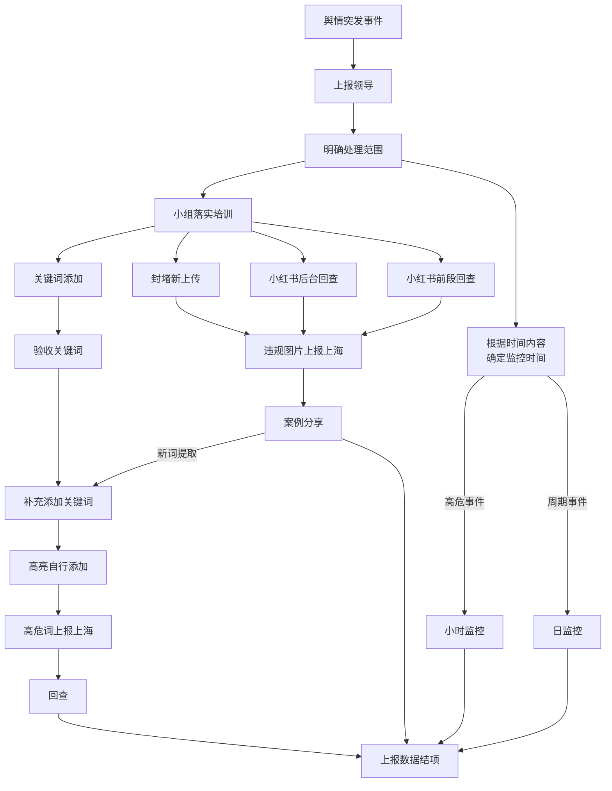

## 新浪微博账号被停用

2021年6月4日，小红书的新浪微博被停用，原因可能是这一天小红书的新浪微博，发送了一条信息「大声告诉我，今天的日期是\_\_\_\_\_\_\_\_！。

+   相关链接
    +   [六四提问后 “小红书”微博账号被停用 - DW](https://www.dw.com/zh/六四提问后-小红书微博账号被停用/a-57793545?maca=chi-rss-chi-all-1127-rdf)
    +   [Social media account of China's Xiaohongshu goes dark after Tiananmen anniversary post - Reuters](https://web.archive.org/web/20210607092626/https://www.reuters.com/world/china/social-media-account-chinas-xiaohongshu-goes-dark-after-tiananmen-anniversary-2021-06-06/)

## 内部 Wiki 泄露

2022年7月8日 左右，六份「小红书Wiki」被泄露，

