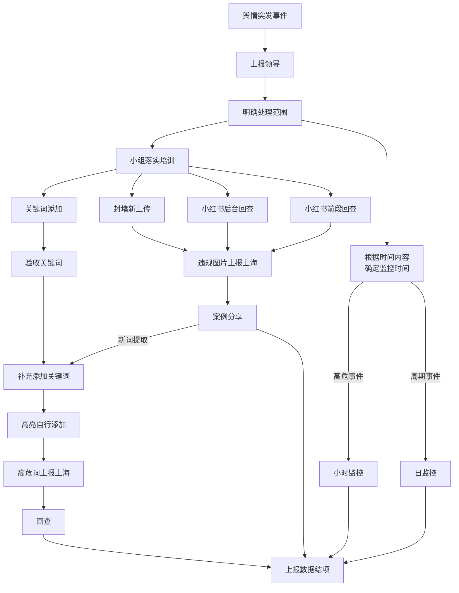

## 简介

〔待续〕

## 新浪微博账号被停用

2021年6月4日，小红书的新浪微博被停用，原因可能是这一天小红书的新浪微博，发送了一条信息「大声告诉我，今天的日期是\_\_\_\_\_\_\_\_！。

+   相关链接
    +   [六四提问后 “小红书”微博账号被停用 - DW](https://web.archive.org/web/20220524103225/https://www.dw.com/zh/六四提问后-小红书微博账号被停用/a-57793545?maca=chi-rss-chi-all-1127-rdf)
    +   [Social media account of China's Xiaohongshu goes dark after Tiananmen anniversary post - Reuters](https://web.archive.org/web/20210607092626/https://www.reuters.com/world/china/social-media-account-chinas-xiaohongshu-goes-dark-after-tiananmen-anniversary-2021-06-06/)

## 内部 Wiki 泄露

2022年7月8日 左右，六份小红书内部关于审查的 Wiki 页面被泄露。

+   `突发事件处理流程与制度_安全部★_小红书Wiki.pdf`
+   `舆情预警渠道 - 安全部★ - 小红书Wiki.pdf`
+   `舆情日报 - 安全部★ - 小红书Wiki.pdf`
+   `一号舆情回查专项 - 安全部★ - 小红书Wiki.pdf`
+   `六四相关资料 - 安全部★ - 小红书Wiki.pdf`
+   `64期间通过舆情挖掘拦截的样本（共5例典型）_安全部★_小红书Wiki.pdf`

其中在《突发事件处理流程与制度》里，给出了小红书内部舆情突发事件处置流程。

各文件的原文，可在 CDT 的《[小红书审查百科](https://chinadigitaltimes.net/space/小红书审查百科)》网页查看。

附言：稍早前的 2022年6月22日，小红书内部的 Wiki 所使用的软件 Atlassian Confluence，被发现严重漏洞 [CVE-2022-26134][]。
这是个能远程执行代码的高危漏洞，尚不明确小红书的 Wiki 泄漏，是否与此事有关。

[CVE-2022-26134]: https://confluence.atlassian.com/doc/confluence-security-advisory-2022-06-02-1130377146.html

## TikTok 难民涌入

2025年1月，由于 TikTok 在美国被封禁的危机感，而小红书允许海外手机号码注册时，不用实名制，
所以出现了美国人使用小红书的浪潮。[^42549]

[^42549]: Claire Fu 与 Meaghan Tobin, 《[美国“TikTok难民”涌入中国小红书](https://web.archive.org/web/20250126142549/https://cn.nytimes.com/technology/20250115/tiktok-rednote-xiaohongshu-app/)》, 纽约时报中文网, 2025-01-15. (参照 2025-02-02).

但大量外国人以及英文内容，让小红书的审查系统无法应对。于是小红书将一些美国用户设置为了「先审后发」，
用户会看到「笔记审核中，预计还需 48 小时」的字样。并公开招聘英文审核员。[^10418]

[^10418]: 李向陽与陳家傑, 《[小紅書急聘英文審核員 「TikTok難民」不解為何刪帖封號](https://web.archive.org/web/20250202141954/https://www.rfa.org/cantonese/news/china-rednote-us-delete-post-tiktok-refugees-01162025010418.html)》, Radio Free Asia, 2025-01-16. (参照 2025-02-02).

由于不了解大陆社交媒体 app 的规则，许多美国用户被限制或封禁。比如有人上传的内容含有 TikTok 的水印，当作涉嫌盗用而违规。
也有衣服颜色与肤色相似，当作裸露而违规。更有人发布的内容，连小红书都不敢提及违规原因。[^15006]

[^15006]: 既要又要还要, 《[【图说天朝】第一批登陆小红书的“抖音难民”已收到“违规提示”了](https://web.archive.org/web/20250126112539/https://chinadigitaltimes.net/chinese/715006.html)》, 中国数字时代, 2025-01-15. (参照 2025-02-02).
