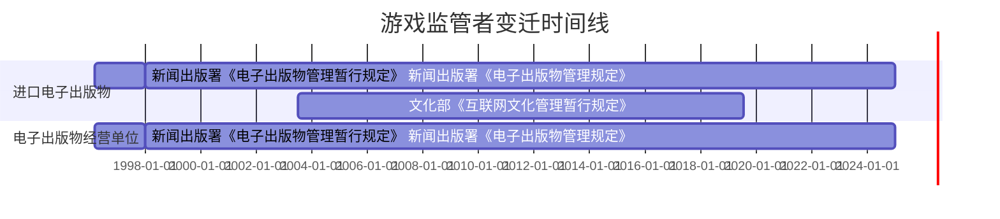

## 简介

谁、什么法令对游戏监管审查？此主题记录相关内容。

## 时间线

> [!info]+ 声明
>
> 以下内容，主要参考了：
>
> +   大狗（赵廷）, 《[审批·审批·审批《见证》系列专题第53期](https://web.archive.org/web/20191112032319/http://play.163.com/special/jianzheng_53/)》, 网易游戏频道, 2013-03-11. (参照 2024-05-06).
> +   对对对你们都是业内©／对长, 《[中国游戏监管史](https://web.archive.org/web/20221102101056/https://www.huxiu.com/article/260579.html)》, 虎嗅, 2018-09-01. (参照 2024-05-06).

1985年7月25日，国务院同意了文化部设立「国家版权局」的请求。「国家出版局」与「国家版权局」为一个机构、两块牌子。[^5873]

[^5873]: 国务院, 《[国务院关于文化部设立国家版权局，出版局改称国家出版局的批复](https://web.archive.org/web/20240506071557/https://www.gov.cn/zhengce/zhengceku/2012-07/16/content_5873.htm)》, 中国政府网, 1985-07-25. (参照 2024-05-06).

1986年10月6日，国务院决定将文化部所属的「国家出版局」，恢复为国务院直属机构。[^65407] 稍后独立成为国家新闻出版署。[^44114]

[^65407]: 国务院, 《[国务院关于恢复国家出版局为国务院直属局建制的通知](https://web.archive.org/web/20180319004343/http://www.gov.cn/xxgk/pub/govpublic/mrlm/201207/t20120725_65407.html)》, 中华人民共和国国务院办公厅, 1986-10-06. (参照 2024-05-06).

[^44114]: 新华网, 《[新闻出版总署六十年机构变迁记](https://web.archive.org/web/20190510225622/http://news.sohu.com/20090911/n266644114.shtml)》, 搜狐新闻, 2009-09-11. (参照 2024-05-06).

1996年3月14日，新闻出版署令第 6 号，发布了《电子出版物管理暂行规定》（发布之日起施行）。[^49621][^49622]
此规定管理各种媒体介质，比如软盘、光盘和集成电路等形态。想要成为这种介质的发行商，需要通过新闻出版署审批。
规定的第五十八条，给予了新闻出版署审查进口产品的权力：

[^49621]: 《[电子出版物管理暂行规定](https://zh.wikisource.org/wiki/电子出版物管理暂行规定)》, 维基文库，自由的图书馆, 1996-03-14. (参照 2024-05-06).

[^49622]: 《[电子出版物管理暂行规定](https://falvdb.com/law/codex/acts/364962-电子出版物管理暂行规定)》, 法律法规数据库, 1996-03-14. (参照 2024-05-06).

> [!rule]+ 《电子出版物管理暂行规定》第五十八条
>
> 电子出版物进口单位进口电子出版物制成品，应当将内容资料报省、自治区、直辖市新闻出版局审核同意后，报新闻出版署审批，
> 经批准后方可进口。

1997年1月2日，李鹏签署国务院令第 210 号，公布了《出版管理条例》。此《条例》在 1997年2月1日 施行。[^001][^002]:
条例略微提到了电子，也是要求出版电子出版物，需要依法登记。以及：「电子出版物的具体管理办法，
由国务院出版行政部门根据本条例的原则制定。」

[^001]: 《[出版管理条例 (1997年)](https://zh.wikisource.org/wiki/出版管理条例_(1997年))》, 维基文库，自由的图书馆, 1997-01-02. (参照 2024-05-06).

[^002]: 《[中华人民共和国国务院令第210号](https://zh.wikisource.org/wiki/中华人民共和国国务院令第210号)》, 维基文库，自由的图书馆, 1997-01-02. (参照 2024-05-06).

1997年12月30日，《电子出版物管理规定》开始施行，取代了《电子出版物管理暂行规定》。[^21821][^21822]

[^21821]: 《[电子出版物管理规定](https://zh.wikisource.org/wiki/电子出版物管理规定)》, 维基文库，自由的图书馆, 1997-12-30. (参照 2024-05-06).

[^21822]: 《[电子出版物管理规定](https://falvdb.com/law/codex/acts/362182-电子出版物管理规定)》, 法律法规数据库, 1997-12-30. (参照 2024-05-06).

1998年9月12日，文化部下发了《关于取缔经营性电脑游戏活动的通知》，原文在网络上找不到，大致内容是禁止网吧提供任何游戏。[^cin]

[^cin]: 《[灰姑娘的守护者：改变游戏业的不可改变之力](/research/灰姑娘的守护者_改变游戏业的不可改变之力.md)》, 家用电脑与游戏, 2011-06-. [Online].

2000年6月15日，国务院发布了国办发〔2000〕44 号，批准了七部门的《[关于开展电子游戏经营场所专项治理的意见](/rule/国务院/办公厅/关于开展电子游戏经营场所专项治理的意见.md)》。
该意见禁止了游戏机在国内的进口与销售，之后俗称为「游戏机禁令」。

2000年8月 左右，信产部向下级部门下发了《关于贯彻落实“关于开展电子游戏经营场所专项治理的意见”有关问题的通知》。
其中解释了电子游戏设备的范围不含家庭及个人用。[^59728] 不过信产部自己的文件，能覆盖七部门经过国务院批准的文件的效用吗？

[^59728]: 湖南省信息产业厅, 《[湖南省信息产业厅关于贯彻落实“关于开展电子游戏经营场所专项治理的意见”有关问题的通知](https://web.archive.org/web/20240509083858/https://gxt.hunan.gov.cn/xxgk_71033/tzgg/200101/t20010112_2059728.html)》, 湖南省工业和信息化厅, 2001-01-12. (参照 2024-05-09).

2001年4月，多部门发布了《[互联网上网服务营业场所管理办法][]》，其中第十条第五款：互联网上网服务营业场所经营者，
不得经营含有色情、赌博、暴力、愚昧迷信等不健康内容的电脑游戏。

[互联网上网服务营业场所管理办法]: https://zh.wikisource.org/wiki/互联网上网服务营业场所管理办法

虽然「不得经营不健康内容的电脑游戏」不等于「可以经营健康的电脑游戏」，但网吧的游戏还是因此解禁了。
文化部的一位副处长补充道：这里的电脑游戏指网络游戏，而单机游戏和局域网联机游戏依然受到《通知》封禁。[^cin]

不过局域网游戏还是有绕过的方法，那就是网吧自己架设服务器，或者使用第三方对战平台。（一段时间后，可能有人忘记了这个禁令，
网吧直接提供单机游戏也没人管了。）

2002年7月9日，中华人民共和国新闻出版总署、中华人民共和国信息产业部令第 17 号，公布了《互联网出版管理暂行规定》
（2002年8月1日 起施行）。[^011][^25170] 规定要求从事互联网出版活动，必须经过批准（报新闻出版总署审批）。

<!-- 最后还提到：之前已经从事互联网出版活动的，应在施行之日起 60 日内办理审批手续。 -->

[^011]: 《[互联网出版管理暂行规定](https://zh.wikisource.org/wiki/互联网出版管理暂行规定)》, 2002-06-27. (参照 2024-05-06).

[^25170]: 光明日报, 《[《互联网出版管理暂行规定》正式颁布8月实施](https://web.archive.org/web/20050209050147/http://tech.sina.com.cn/i/c/2002-07-10/125170.shtml)》, 新浪网, 2002-07-10. (参照 2024-05-06).

2003年5月10日，中华人民共和国文化部令第 27 号，公布了《[互联网文化管理暂行规定](/rule/文化部/互联网文化管理暂行规定.md)》（2003年7月1日 起施行）。[^021]
规定的第十六条，给予了文化部审查进口产品的权力：

[^021]: 《[互联网文化管理暂行规定 (2003年)](https://zh.wikisource.org/wiki/互联网文化管理暂行规定_(2003年))》, 维基文库，自由的图书馆, 2003-05-10. (参照 2024-05-06).

> [!rule]+ 《互联网文化管理暂行规定》第十六条
>
> 互联网文化单位进口互联网文化产品应当报文化部进行内容审查。
>
> 文化部应当自收到内容审查申请书之日起 30 日内作出批准或者不批准的决定，并通知申请人。批准的，发给批准文件；不批准的，
> 应当说明理由。

2003年6月19日，北京市新闻出版局组织召开北京地区电子和网络游戏出版政策通气会。发言人是新闻出版总署音像电子和网络出版管理司
（音像司）副司长寇晓伟。[^42774] 其中提到：

[^42774]: 新浪游戏, 《[北京电子和网络游戏出版政策通气会胜利召开！](https://web.archive.org/web/20030812170825/http://games.sina.com.cn/newgames/2003/06/06242774.shtml)》, 新浪网, 2003-06-24. (参照 2024-05-06).

+   牢固占领互联网出版阵地
+   筹建新闻出版总署网络出版监管中心；建立网络出版监管系统。此项目已上报国家发展与改革委员会申请立项，
    准备投资 1.2 亿元，分两期完成

等细节。最后提到职责问题：「其它部门未经国务院授权，也未征求新闻出版总署意见，自行制定涉及互联网出版管理职责的规章，
是不严肃的，会造成出版行业混乱，不利于精神文明建设」「最后希望有关出版经营单位认真学习国务院的有关法规，辩清是非，
依法经营。」

2003年12月，第二届中国互联网大会在北京举办。[^03318][^37629] 文化部市场司庹祖海副司长在会上，
强调了 2000 年的政策没有改变（《关于电子游戏场所管理的通知》），「国内任何企业是不允许生产和进口游戏机」。[^65519]

[^03318]: 李冬, 《[第二届 2003中国互联网大会回顾](https://web.archive.org/web/20240509082939/https://news.cntv.cn/special/2012cic/20120913/103318.shtml)》, 中国网络电视台, 2012-09-13. (参照 2024-05-09).

[^37629]: 中国互联网协会, 《[中国互联网大会精彩回顾｜2003年（第二届）中国互联网大会：透视互联网，迈向e时代](https://web.archive.org/web/20240509082836/https://www.isc.org.cn/article/37629.html)》, 中国互联网协会, 2020-06-08. (参照 2024-05-09).

[^65519]: ChinaByte, 《[文化部副司长称国家对游戏机的政策尚未放宽](https://web.archive.org/web/20031210105256/http://tech.sina.com.cn/it/2003-12-08/1843265519.shtml)》, 新浪网, 2003-12-08. (参照 2024-05-09).

---

〔待续〕

2007年12月29日，《互联网上网服务营业场所管理办法》被废止。网吧里的单机游戏和局域网游戏，正式恢复合法性。[^65472]

[^65472]: 孙家正, 《[中华人民共和国文化部令（第43号） 文化部关于废止部分规章和规范性文件的决定（2008年第22号国务院公报）](https://web.archive.org/web/20120630012450/http://www.gov.cn/gongbao/content/2008/content_1065472.htm)》, 中国政府网, 2007-12-29. (参照 2024-05-09).

2019年7月23日，文旅部宣布了《网络游戏管理暂行办法》废止的消息，这意味着文化和旅游部不再参与网络游戏审查。[^07591]

[^07591]: 游戏产业网, 《[文旅部：〈网络游戏管理暂行办法〉废止](https://web.archive.org/web/20220416060630/http://game.people.com.cn/n1/2019/0821/c40130-31307591.html)》, 人民网, 2019-08-21. (参照 2024-05-06).

〔待续〕（太麻烦了，也许近期不会补充）

## 甘特图时间线

〔这图不好画，先暂时放弃〕

